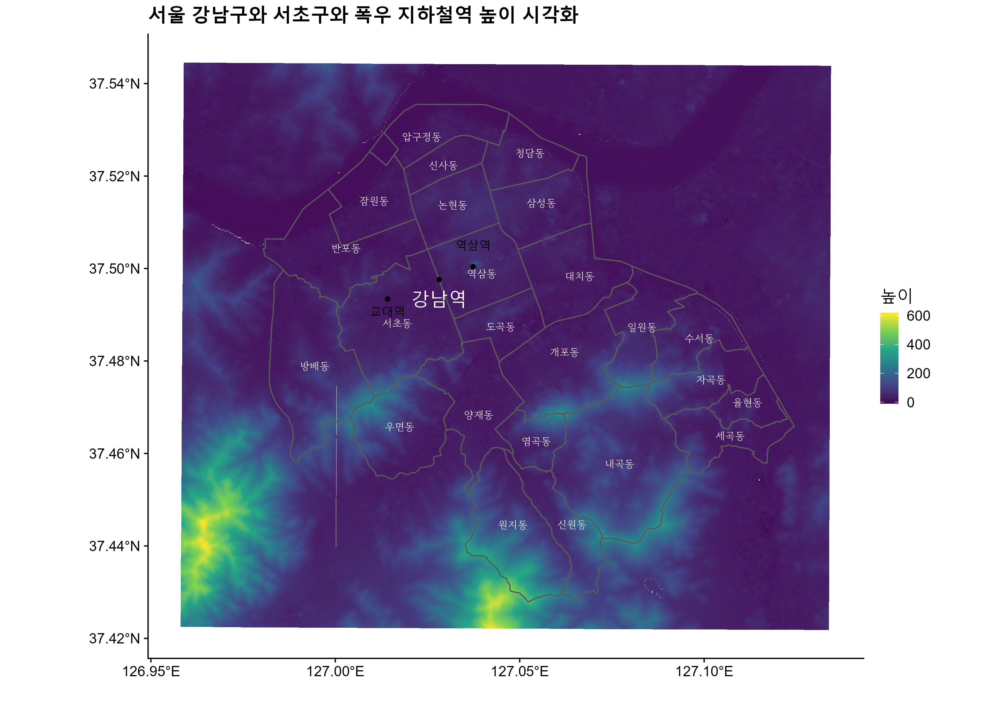
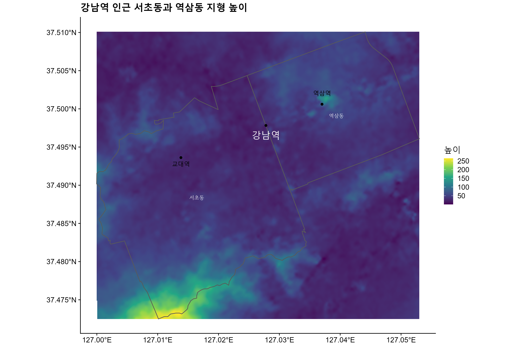

 
``` {r, include=FALSE}
knitr::opts_chunk$set(echo = TRUE, message=FALSE, warning=FALSE,
                      comment="", digits = 3, tidy = FALSE, prompt = FALSE, fig.align = 'center')
```


# 예제 {#convert-example}

XY 숫자로 구성된 

[Creating a map based on address or xy coordinates - convert to lat and long?](https://stackoverflow.com/questions/55572749/creating-a-map-based-on-address-or-xy-coordinates-convert-to-lat-and-long)

[Elevation data in R, Ivan Lizarazo, 21.09.2020](https://rpubs.com/ials2un/elevationfromR)

```{r}
df <- data.frame( city = "Trinbak", lon = 556305, lat = 6306381 )

library(sf)
library(leaflet)

df.sf <- st_as_sf( df, coords = c("lon", "lat") ) %>%
  st_set_crs( 2198 ) %>%   #set coordinate system used
  st_transform( 4326 )     #transform coordinates to WGS84 coordinates

leaflet() %>% addTiles() %>% addMarkers( data = df.sf )
```


# 서울시 강남구  {#gangnam-elevation}

GIS DEVELOPER [대한민국 최신 행정구역(SHP) 다운로드](http://www.gisdeveloper.co.kr/?p=2332) 웹사이트에서 
침수피해가 이슈가 된 강남구와 인접한 서초구 두 구를 뽑아 시각화해보자.

강남역이 위치한 서초구와 강남구 두 구에 대한 높이 데이터는 [`elevatr`](https://cran.r-project.org/web/packages/elevatr/index.html) 패키지로 해결한다.

```{r gangnam-elevation, eval = FALSE}

library(tidyverse)
library(raster)
library(viridis)
library(sf)

sgg_sf <- sf::read_sf("data/shapefile/SIG_201902/TL_SCCO_SIG.shp") %>% 
  mutate(SIG_KOR_NM = iconv(SIG_KOR_NM, from = "cp949", to ="utf-8"))

# gangnam <- sgg_sf %>%
#   filter(SIG_KOR_NM == "강남구")
# 
# gangnam

# sgg_sf %>%
#   filter(SIG_KOR_NM == "서초구")

emd_sf <- sf::read_sf("data/shapefile/EMD_201902/TL_SCCO_EMD.shp")

gangnam <- emd_sf %>% 
  mutate(EMD_KOR_NM = iconv(EMD_KOR_NM, from = "cp949", to ="utf-8")) %>% 
  mutate(SIG_CD = str_sub(EMD_CD, 1, 5)) %>% 
  filter(SIG_CD == 11680 | SIG_CD == 11650) # 강남구(11680)와 서초구(11650) 

library(elevatr)
elevation <- get_elev_raster(gangnam, z = 14)

elevation 

plot(elevation, main="강남역 인근 강남구와 서초구")
plot(gangnam, add=TRUE)
```

# 높이 데이터와 매칭

지하철 2호선 교대역, 강남역, 역삼역으로 이어지는 3개 지하철역을 표시하고 
서초구와 강남구의 높이 데이터를 매칭한다.

```{r two-gu, eval = FALSE}

elevation_tbl <- elevation %>% 
  as.data.frame(xy=TRUE) %>% 
  drop_na() %>% 
  as_tibble() %>% 
  set_names(c("x", "y", "value")) %>% 
  filter(value > -10)

gangnam_station <- st_as_sf(tibble(y = 37.497952, x = 127.027619, label = "강남역"), 
                            coords = c("x", "y"), remove = FALSE,  
                            crs = 4326, agr = "constant")

yeoksam_station <- st_as_sf(tibble(y = 37.5007694, x = 127.0368262, label = "역삼역"), 
                            coords = c("x", "y"), remove = FALSE,  
                            crs = 4326, agr = "constant")

edu_station <- st_as_sf(tibble(y = 37.4936866, x = 127.0136717, label = "교대역"), 
                            coords = c("x", "y"), remove = FALSE,  
                            crs = 4326, agr = "constant")

gangnam_elevation_g <- gangnam %>% 
  ggplot() +
    geom_raster(data = elevation_tbl, aes(x= x, y= y, fill = value)) +
    geom_sf(aes(geometry = geometry), fill = 'transparent')   +
    geom_sf_text(aes(label =EMD_KOR_NM),size=3, family="MaruBuri", color = "white") +
    scale_fill_viridis_c(name = "높이") +
    cowplot::theme_cowplot() +
    labs(x = "", y = "",
         title = "서울 강남구와 서초구와 폭우 지하철역 높이 시각화")  +
    geom_sf(data = gangnam_station, size = 1.5)  +
    geom_sf(data = yeoksam_station, size = 1.5) +
    geom_sf(data = edu_station, size = 1.5) +
    geom_sf_text(data = gangnam_station, aes(label = label), size = 5.5, vjust = 2.0, color ="white", size = 2) +
    geom_sf_text(data = yeoksam_station, aes(label = label), size = 3.5, vjust = -2.0) +
    geom_sf_text(data = edu_station, aes(label = label), size = 3.5, vjust = 2.0)

ggsave( glue::glue("fig/gangnam_elevation_g.png") , 
        gangnam_elevation_g,
        device = ragg::agg_png, 
        width = 297, height = 210, units = "mm", res = 600) 

```

{width=100%}


# 역삼동과 서초동

서초동과 역삼동만 확대하여 강남역 인근 높이를 확인한다.

```{r two-dong, eval = FALSE}
gangnam_bbox <- gangnam %>% 
  filter(EMD_KOR_NM %in% c("역삼동", "서초동")) %>% 
  st_bbox()

station_elevation <- elevation_tbl %>% 
  filter(x > gangnam_bbox$xmin, x < gangnam_bbox$xmax,
         y > gangnam_bbox$ymin, y < gangnam_bbox$ymax)

two_dong_g <- gangnam %>% 
  filter(EMD_KOR_NM %in% c("역삼동", "서초동")) %>% 
  ggplot() +
    geom_raster(data = station_elevation, aes(x= x, y= y, fill = value)) +
    geom_sf(aes(geometry = geometry), fill = 'transparent')   +
    geom_sf_text(aes(label =EMD_KOR_NM),size=3, family="MaruBuri", color = "white") +
    scale_fill_viridis_c(name = "높이") +
    cowplot::theme_cowplot() +
    labs(x = "", y = "",
         title = "강남역 인근 서초동과 역삼동 지형 높이")  +
    geom_sf(data = gangnam_station, size = 1.5)  +
    geom_sf(data = yeoksam_station, size = 1.5) +
    geom_sf(data = edu_station, size = 1.5) +
    geom_sf_text(data = gangnam_station, aes(label = label), size = 5.5, vjust = 2.0, color ="white", size = 2) +
    geom_sf_text(data = yeoksam_station, aes(label = label), size = 3.5, vjust = -2.0) +
    geom_sf_text(data = edu_station, aes(label = label), size = 3.5, vjust = 2.0)

ggsave( glue::glue("fig/two_dong_g.png") , 
        two_dong_g,
        device = ragg::agg_png, 
        width = 297, height = 210, units = "mm", res = 600) 
```


{width=100%}


# 3D로 살펴보기


```{r rayshader, eval = FALSE}
library(rayshader)

two_dong_sf <- gangnam %>% 
  filter(EMD_KOR_NM %in% c("역삼동", "서초동"))

station_elevation <- raster::crop(elevation, two_dong_sf)

plot(station_elevation)

station_matrix <- raster_to_matrix(station_elevation) %>% 
  resize_matrix(0.25)

flood_map <- station_matrix %>%
  height_shade() %>% 
  add_overlay(sphere_shade(station_matrix, texture = "desert", 
                           zscale=4, colorintensity = 5), alphalayer=0.5) %>%
  add_shadow(lamb_shade(station_matrix, zscale = 6),0) %>%
  add_shadow(ambient_shade(station_matrix), 0) %>%
  add_shadow(texture_shade(station_matrix, detail=8/10, contrast=9, brightness = 11), 0.1) 

contour_color = "#7d4911"

contours_layer <- generate_contour_overlay(station_matrix, color = contour_color, 
                                       linewidth = 0.05, 
                                       levels=seq(min(station_matrix),
                                                  max(station_matrix),
                                                  by=20))


overlay_image_terrain <- geoviz::slippy_overlay(station_elevation, 
                 image_source = "stamen",
                 image_type = "terrain",
                 png_opacity = 1)

flood_map %>%
  # add_overlay(contours_layer, alphalayer = 0.95) %>% 
  add_overlay(overlay_image_terrain) %>%
  rayshader::plot_map()

```

