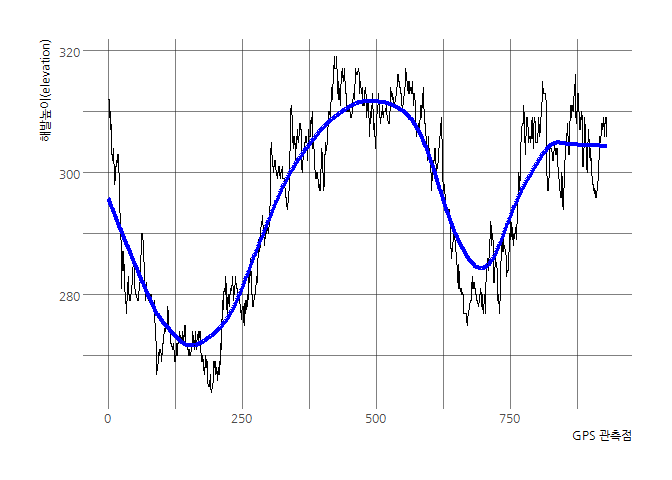
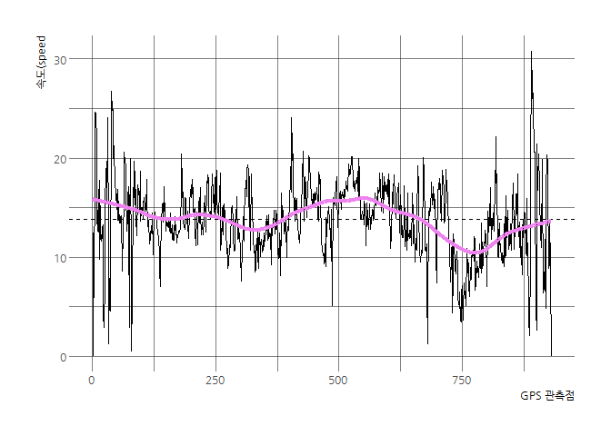
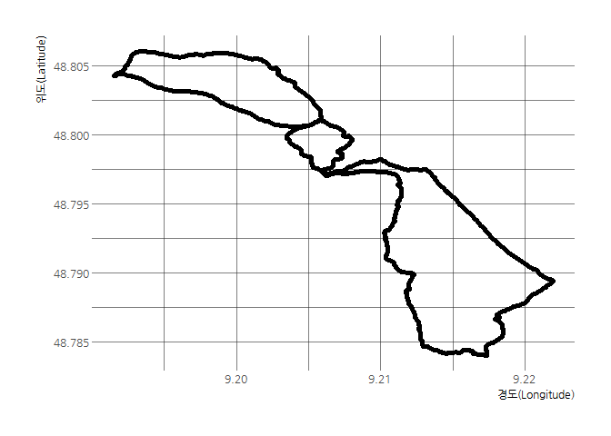
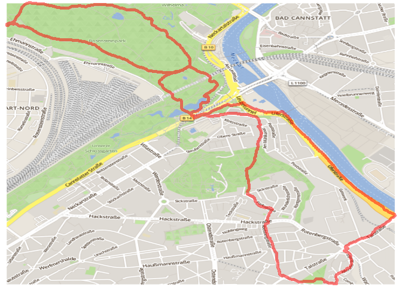
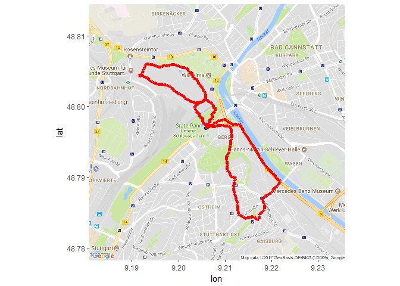

# 공간통계를 위한 데이터 과학
 


## 1. GPS 이동경로 시각화 [^gps-xml-base-r]

[^gps-xml-base-r]: [Stay on track: Plotting GPS tracks with R](http://rcrastinate.blogspot.kr/2014/09/stay-on-track-plotting-gps-tracks-with-r.html)

GSP 데이터(`GPX` 포맷)를 R `XML` 팩키지를 통해 불러 들이고 나서 이를 시각화한다.

## 2. 데이터 가져오기

[http://www.wolferonline.de/uploads/run.gpx](http://www.wolferonline.de/uploads/run.gpx) 웹사이트에 독일 슈트트가르트 
GPS 데이터가 있어 이를 `download.file()` 함수를 사용해서 "data/run.gpx" 디렉토리에 파일로 저장한다.

XML 팩키지 `htmlTreeParse` 함수를 사용하여 파싱한 후에 해발고도(`elevations`), 시간(`times`), 좌표(`coords`) 정보를 추출한다.
그리고 나서 분석가능한 형태인 데이터프레임으로 변환시킨다.


```r
# 0. 환경설정 -----------------------------
# library(XML)
# library(OpenStreetMap)
# library(tidyverse)
# library(lubridate)
# library(raster)
# library(ggmap)
# library(hrbrthemes)
# library(extrafont)
# loadfonts()

# 1. 데이터 가져오기 ----------------------

download.file("http://www.wolferonline.de/uploads/run.gpx", "data/run.gpx")

pfile <- htmlTreeParse("data/run.gpx", error = function (...) {}, useInternalNodes = TRUE)

# 2. 데이터 전처리 -------------------------
# elevation, times, coordinate 추출
elevations <- as.numeric(xpathSApply(pfile, path = "//trkpt/ele", xmlValue))
times <- xpathSApply(pfile, path = "//trkpt/time", xmlValue)
coords <- xpathSApply(pfile, path = "//trkpt", xmlAttrs)

# 좌표(coordinate)에서 위경도 추출
lats <- as.numeric(coords["lat",])
lons <- as.numeric(coords["lon",])

# 데이터프레임 변환
geo_df <- data.frame(lat = lats, lon = lons, ele = elevations, time = times)
rm(list=c("elevations", "lats", "lons", "pfile", "times", "coords"))

geo_df %>% 
  DT::datatable()
```

<!--html_preserve--><div id="htmlwidget-aef79e1adf6c965360ed" style="width:100%;height:auto;" class="datatables html-widget"></div>
<script type="application/json" data-for="htmlwidget-aef79e1adf6c965360ed">{"x":{"filter":"none","data":[["1","2","3","4","5","6","7","8","9","10","11","12","13","14","15","16","17","18","19","20","21","22","23","24","25","26","27","28","29","30","31","32","33","34","35","36","37","38","39","40","41","42","43","44","45","46","47","48","49","50","51","52","53","54","55","56","57","58","59","60","61","62","63","64","65","66","67","68","69","70","71","72","73","74","75","76","77","78","79","80","81","82","83","84","85","86","87","88","89","90","91","92","93","94","95","96","97","98","99","100","101","102","103","104","105","106","107","108","109","110","111","112","113","114","115","116","117","118","119","120","121","122","123","124","125","126","127","128","129","130","131","132","133","134","135","136","137","138","139","140","141","142","143","144","145","146","147","148","149","150","151","152","153","154","155","156","157","158","159","160","161","162","163","164","165","166","167","168","169","170","171","172","173","174","175","176","177","178","179","180","181","182","183","184","185","186","187","188","189","190","191","192","193","194","195","196","197","198","199","200","201","202","203","204","205","206","207","208","209","210","211","212","213","214","215","216","217","218","219","220","221","222","223","224","225","226","227","228","229","230","231","232","233","234","235","236","237","238","239","240","241","242","243","244","245","246","247","248","249","250","251","252","253","254","255","256","257","258","259","260","261","262","263","264","265","266","267","268","269","270","271","272","273","274","275","276","277","278","279","280","281","282","283","284","285","286","287","288","289","290","291","292","293","294","295","296","297","298","299","300","301","302","303","304","305","306","307","308","309","310","311","312","313","314","315","316","317","318","319","320","321","322","323","324","325","326","327","328","329","330","331","332","333","334","335","336","337","338","339","340","341","342","343","344","345","346","347","348","349","350","351","352","353","354","355","356","357","358","359","360","361","362","363","364","365","366","367","368","369","370","371","372","373","374","375","376","377","378","379","380","381","382","383","384","385","386","387","388","389","390","391","392","393","394","395","396","397","398","399","400","401","402","403","404","405","406","407","408","409","410","411","412","413","414","415","416","417","418","419","420","421","422","423","424","425","426","427","428","429","430","431","432","433","434","435","436","437","438","439","440","441","442","443","444","445","446","447","448","449","450","451","452","453","454","455","456","457","458","459","460","461","462","463","464","465","466","467","468","469","470","471","472","473","474","475","476","477","478","479","480","481","482","483","484","485","486","487","488","489","490","491","492","493","494","495","496","497","498","499","500","501","502","503","504","505","506","507","508","509","510","511","512","513","514","515","516","517","518","519","520","521","522","523","524","525","526","527","528","529","530","531","532","533","534","535","536","537","538","539","540","541","542","543","544","545","546","547","548","549","550","551","552","553","554","555","556","557","558","559","560","561","562","563","564","565","566","567","568","569","570","571","572","573","574","575","576","577","578","579","580","581","582","583","584","585","586","587","588","589","590","591","592","593","594","595","596","597","598","599","600","601","602","603","604","605","606","607","608","609","610","611","612","613","614","615","616","617","618","619","620","621","622","623","624","625","626","627","628","629","630","631","632","633","634","635","636","637","638","639","640","641","642","643","644","645","646","647","648","649","650","651","652","653","654","655","656","657","658","659","660","661","662","663","664","665","666","667","668","669","670","671","672","673","674","675","676","677","678","679","680","681","682","683","684","685","686","687","688","689","690","691","692","693","694","695","696","697","698","699","700","701","702","703","704","705","706","707","708","709","710","711","712","713","714","715","716","717","718","719","720","721","722","723","724","725","726","727","728","729","730","731","732","733","734","735","736","737","738","739","740","741","742","743","744","745","746","747","748","749","750","751","752","753","754","755","756","757","758","759","760","761","762","763","764","765","766","767","768","769","770","771","772","773","774","775","776","777","778","779","780","781","782","783","784","785","786","787","788","789","790","791","792","793","794","795","796","797","798","799","800","801","802","803","804","805","806","807","808","809","810","811","812","813","814","815","816","817","818","819","820","821","822","823","824","825","826","827","828","829","830","831","832","833","834","835","836","837","838","839","840","841","842","843","844","845","846","847","848","849","850","851","852","853","854","855","856","857","858","859","860","861","862","863","864","865","866","867","868","869","870","871","872","873","874","875","876","877","878","879","880","881","882","883","884","885","886","887","888","889","890","891","892","893","894","895","896","897","898","899","900","901","902","903","904","905","906","907","908","909","910","911","912","913","914","915","916","917","918","919","920","921","922","923","924","925","926","927","928","929","930","931"],[48.7845666666667,48.7845666666667,48.78466,48.784745,48.7847966666667,48.784855,48.784905,48.78496,48.78501,48.78506,48.78512,48.785185,48.785255,48.7853133333333,48.78538,48.7854666666667,48.785565,48.785655,48.7857416666667,48.785825,48.785915,48.7860066666667,48.786105,48.7861666666667,48.7862216666667,48.78631,48.7864,48.786465,48.7865233333333,48.78657,48.786625,48.78667,48.78672,48.7868,48.78678,48.78681,48.78685,48.786945,48.7870216666667,48.78709,48.7871516666667,48.7872066666667,48.787255,48.78729,48.78733,48.787375,48.7874416666667,48.787505,48.7875466666667,48.7875766666667,48.7876,48.78763,48.78769,48.7877416666667,48.7877716666667,48.7878183333333,48.7878816666667,48.787965,48.7880416666667,48.788125,48.7881983333333,48.7882816666667,48.788345,48.7884,48.78845,48.7885,48.788545,48.78859,48.78866,48.788725,48.788785,48.7888516666667,48.78892,48.78897,48.78904,48.78909,48.78916,48.78923,48.7893,48.78938,48.78938,48.789465,48.789505,48.78954,48.78959,48.789655,48.7897266666667,48.789795,48.7898516666667,48.7899266666667,48.7900083333333,48.79009,48.790155,48.79022,48.7902816666667,48.790345,48.7904066666667,48.790475,48.7905333333333,48.790605,48.790675,48.790735,48.790795,48.7908566666667,48.7909216666667,48.7909866666667,48.791055,48.791115,48.79119,48.79126,48.791325,48.791385,48.7914466666667,48.7915116666667,48.791575,48.79164,48.7917,48.7917616666667,48.7918266666667,48.7918866666667,48.7919516666667,48.792015,48.792065,48.7921416666667,48.7922083333333,48.7922766666667,48.79235,48.7924216666667,48.792495,48.79257,48.792645,48.79272,48.792795,48.7928616666667,48.79293,48.793,48.79306,48.79314,48.79322,48.7932783333333,48.7933566666667,48.7934333333333,48.793515,48.793605,48.793695,48.79378,48.7938666666667,48.79395,48.7940366666667,48.79411,48.7941816666667,48.7942483333333,48.794315,48.7943716666667,48.794445,48.794515,48.794585,48.794655,48.79472,48.79479,48.7948516666667,48.79492,48.7949966666667,48.795075,48.795145,48.79522,48.795295,48.795365,48.79543,48.79549,48.795555,48.79562,48.79568,48.79574,48.7958,48.79587,48.795935,48.796,48.7960666666667,48.79614,48.796225,48.796295,48.79636,48.796425,48.796515,48.7966016666667,48.79669,48.796785,48.79688,48.7969666666667,48.7970516666667,48.79713,48.7972,48.797265,48.797335,48.797395,48.797455,48.7975,48.797465,48.797435,48.7974416666667,48.797455,48.79747,48.797485,48.797485,48.797475,48.797445,48.79744,48.79746,48.7975016666667,48.79755,48.797565,48.79761,48.7976466666667,48.797685,48.79772,48.797755,48.797785,48.7978166666667,48.797885,48.797935,48.797985,48.7980466666667,48.79809,48.798155,48.7982066666667,48.7981866666667,48.79814,48.798095,48.79806,48.7980466666667,48.798015,48.7979766666667,48.79799,48.798035,48.79806,48.79803,48.797985,48.797955,48.797905,48.797845,48.79778,48.7977366666667,48.7977,48.7976666666667,48.7976266666667,48.79757,48.7975,48.797435,48.79738,48.797335,48.797325,48.797315,48.797295,48.79724,48.7971716666667,48.797125,48.797085,48.797035,48.7970116666667,48.797075,48.79714,48.797195,48.79727,48.7973516666667,48.79742,48.79748,48.7975266666667,48.79756,48.79759,48.79764,48.797715,48.79779,48.79787,48.79795,48.7980416666667,48.798135,48.7982266666667,48.79831,48.798385,48.7984266666667,48.7984216666667,48.798435,48.798475,48.7985366666667,48.798615,48.798695,48.79878,48.79886,48.798925,48.7989816666667,48.79904,48.79909,48.79914,48.7992,48.799265,48.799335,48.7994,48.7994816666667,48.799565,48.7996316666667,48.799685,48.799755,48.799835,48.799905,48.7999816666667,48.8000516666667,48.8001116666667,48.8001716666667,48.800255,48.8003133333333,48.80038,48.8004366666667,48.8004833333333,48.80052,48.800545,48.800575,48.80061,48.800645,48.80068,48.80072,48.8007633333333,48.80083,48.8009,48.8009616666667,48.8010016666667,48.8010666666667,48.80115,48.801235,48.8013133333333,48.8013866666667,48.80148,48.80156,48.80164,48.801725,48.80179,48.801875,48.801955,48.802035,48.802095,48.80217,48.80224,48.802315,48.80239,48.8024616666667,48.8025416666667,48.8026066666667,48.80269,48.80274,48.8028216666667,48.802895,48.8029566666667,48.80303,48.8030916666667,48.80315,48.80322,48.8032716666667,48.803325,48.803385,48.80344,48.803535,48.8036166666667,48.803695,48.8037666666667,48.8038183333333,48.8038616666667,48.803885,48.803935,48.80397,48.80402,48.80408,48.8041466666667,48.804195,48.8042483333333,48.80432,48.804395,48.80447,48.8045666666667,48.804645,48.804725,48.8047866666667,48.80481,48.80477,48.804795,48.8048516666667,48.80493,48.805025,48.805105,48.805165,48.805225,48.805265,48.8053216666667,48.805385,48.805435,48.80545,48.8054616666667,48.8054816666667,48.805475,48.80546,48.80547,48.80551,48.8055466666667,48.80559,48.8056266666667,48.80567,48.805705,48.80575,48.8057866666667,48.80582,48.8058466666667,48.805855,48.805865,48.805885,48.8058916666667,48.805895,48.80588,48.8059,48.8059,48.80589,48.8058816666667,48.80584,48.80582,48.8058,48.80579,48.80576,48.8057216666667,48.805735,48.80577,48.805805,48.8058,48.8057666666667,48.805765,48.8057666666667,48.805755,48.8057066666667,48.80566,48.805625,48.805595,48.80559,48.8056,48.805615,48.80564,48.805675,48.8057,48.80573,48.80576,48.8057883333333,48.80581,48.805825,48.805855,48.8058816666667,48.8059166666667,48.80594,48.805945,48.80595,48.8059566666667,48.80597,48.8059916666667,48.806005,48.8060133333333,48.8060066666667,48.80598,48.805935,48.8058816666667,48.805815,48.8057516666667,48.8056666666667,48.8055966666667,48.80551,48.805415,48.80534,48.805265,48.8052,48.805115,48.805035,48.8049616666667,48.80489,48.804795,48.804695,48.80461,48.804545,48.8045,48.8044516666667,48.80439,48.804325,48.8042533333333,48.8042416666667,48.80433,48.804405,48.8044466666667,48.8044216666667,48.8043916666667,48.804365,48.804375,48.80433,48.804265,48.804225,48.80422,48.8041833333333,48.804155,48.80413,48.804105,48.80407,48.80402,48.803965,48.80391,48.80384,48.803765,48.8036916666667,48.803635,48.803585,48.8035366666667,48.803485,48.8034366666667,48.8034,48.803395,48.803365,48.80331,48.803265,48.80324,48.80322,48.80319,48.80316,48.803135,48.8031233333333,48.8031116666667,48.8031166666667,48.8031116666667,48.8031216666667,48.803105,48.8031,48.803095,48.803085,48.803075,48.803055,48.803025,48.80301,48.8029966666667,48.802955,48.80291,48.80287,48.802825,48.802775,48.80274,48.80269,48.8026216666667,48.80256,48.8025066666667,48.8024316666667,48.8023716666667,48.8023066666667,48.80225,48.802185,48.8021316666667,48.802095,48.80207,48.802025,48.80198,48.80193,48.8018916666667,48.801855,48.801825,48.80178,48.8017483333333,48.80171,48.80167,48.80164,48.80162,48.80157,48.8015216666667,48.8014683333333,48.801415,48.80134,48.80128,48.801215,48.80115,48.80111,48.8010716666667,48.801025,48.800985,48.800965,48.80093,48.80088,48.80083,48.8007616666667,48.800705,48.800685,48.80068,48.8006616666667,48.800645,48.800635,48.8006216666667,48.8006,48.800585,48.80057,48.800565,48.80055,48.800545,48.8005366666667,48.8005366666667,48.800575,48.8006216666667,48.8006416666667,48.800645,48.800645,48.8006916666667,48.80075,48.8008016666667,48.8008633333333,48.800925,48.80098,48.80101,48.80099,48.800935,48.800885,48.8008266666667,48.80077,48.8007166666667,48.80066,48.80061,48.8005766666667,48.80055,48.800505,48.800465,48.800395,48.8003316666667,48.80027,48.800185,48.8000866666667,48.79999,48.7998966666667,48.7998566666667,48.799875,48.799895,48.79983,48.79977,48.799715,48.7996383333333,48.79956,48.7994816666667,48.799405,48.7993233333333,48.7992666666667,48.7992116666667,48.79914,48.799085,48.79902,48.79897,48.798915,48.79885,48.79878,48.7987116666667,48.7986866666667,48.79866,48.798585,48.7984966666667,48.798415,48.7983266666667,48.79825,48.79822,48.79822,48.7982033333333,48.7981366666667,48.79806,48.797985,48.797905,48.79783,48.79775,48.7976866666667,48.797635,48.7975766666667,48.7975283333333,48.797495,48.797465,48.79742,48.797345,48.7972766666667,48.7972033333333,48.7971716666667,48.79715,48.79711,48.7971366666667,48.797175,48.7972066666667,48.7972366666667,48.79726,48.79726,48.797245,48.797225,48.79719,48.7971333333333,48.7971316666667,48.79714,48.79716,48.79719,48.7972016666667,48.797185,48.7971866666667,48.79726,48.7972866666667,48.797295,48.79732,48.797335,48.79735,48.79735,48.7973566666667,48.7973566666667,48.79737,48.797365,48.7973216666667,48.7973016666667,48.797285,48.797275,48.797275,48.79728,48.797265,48.7972466666667,48.7972033333333,48.79715,48.797125,48.797085,48.7970166666667,48.79694,48.79685,48.796785,48.796695,48.79661,48.7965366666667,48.79647,48.79641,48.796365,48.79629,48.7962216666667,48.796145,48.7960716666667,48.79598,48.7959,48.7958066666667,48.79573,48.795655,48.7955616666667,48.7954916666667,48.795415,48.7953416666667,48.79527,48.7951966666667,48.79515,48.7950866666667,48.7950066666667,48.794935,48.79487,48.79481,48.794735,48.7946666666667,48.794585,48.794505,48.794435,48.79436,48.7942716666667,48.7941916666667,48.7941,48.79402,48.7939416666667,48.7938666666667,48.793785,48.79371,48.7936416666667,48.7935716666667,48.793495,48.79341,48.79333,48.79326,48.793175,48.7931,48.793045,48.7930216666667,48.79294,48.79286,48.79279,48.7927,48.79261,48.792525,48.79244,48.79236,48.79229,48.792215,48.79214,48.792065,48.791975,48.79189,48.791805,48.791715,48.79164,48.7915616666667,48.79148,48.7914016666667,48.7913116666667,48.7912266666667,48.79115,48.7910616666667,48.790985,48.79094,48.7909,48.790865,48.790805,48.790705,48.790605,48.7905316666667,48.7904616666667,48.7903883333333,48.790295,48.790235,48.7901666666667,48.790115,48.790055,48.79005,48.790025,48.789995,48.78999,48.7899616666667,48.7899216666667,48.789845,48.78978,48.789715,48.78963,48.789545,48.7894666666667,48.789385,48.78931,48.78922,48.789125,48.789045,48.788975,48.78889,48.7888,48.788755,48.78873,48.78866,48.7885666666667,48.78847,48.788375,48.7882666666667,48.788195,48.78812,48.7880366666667,48.787965,48.7878833333333,48.7877766666667,48.7877016666667,48.787645,48.78757,48.787495,48.78741,48.787335,48.787255,48.7871716666667,48.78707,48.786965,48.786855,48.78678,48.786685,48.7865916666667,48.7865233333333,48.78644,48.786345,48.78625,48.786165,48.78608,48.785995,48.7859216666667,48.7858516666667,48.78577,48.785675,48.785575,48.7854766666667,48.7853716666667,48.7853,48.785205,48.78513,48.78503,48.784955,48.7848616666667,48.784775,48.7847,48.78466,48.784685,48.78468,48.7846416666667,48.7846,48.78453,48.784445,48.784395,48.784375,48.784355,48.784305,48.784255,48.78421,48.7841766666667,48.784165,48.784165,48.784195,48.78424,48.784235,48.78424,48.7842416666667,48.784235,48.784225,48.7842866666667,48.784335,48.7843966666667,48.7844133333333,48.7844116666667,48.7843866666667,48.78434,48.78431,48.7842433333333,48.784165,48.78416,48.78412,48.784075,48.78406,48.78407,48.7840566666667,48.7840416666667,48.784015,48.7841,48.7841733333333,48.7842666666667,48.78434,48.784425,48.784425],[9.2173,9.2173,9.217295,9.217335,9.21741,9.21755,9.21767,9.217775,9.217885,9.217985,9.21807333333333,9.218145,9.218255,9.21835,9.218415,9.218455,9.21848,9.2185,9.218505,9.2185,9.218485,9.21845,9.218405,9.21843,9.218415,9.218385,9.218315,9.21824166666667,9.21816666666667,9.21803,9.21794,9.218055,9.218145,9.21823,9.21822,9.218105,9.218035,9.21805,9.21814833333333,9.21826166666667,9.218375,9.218485,9.21859666666667,9.218695,9.218795,9.218885,9.219,9.219105,9.21921166666667,9.21933166666667,9.21945,9.219585,9.2197,9.219795,9.21989666666667,9.219985,9.22007166666667,9.220135,9.220205,9.22026666666667,9.22031666666667,9.22036,9.220435,9.220515,9.220615,9.22071,9.2208,9.220885,9.22101,9.22112166666667,9.221195,9.221275,9.221375,9.22144666666667,9.22152,9.22153,9.22164,9.221765,9.22186333333333,9.22192,9.22193,9.22188666666667,9.22176666666667,9.22165,9.22154,9.221405,9.22129333333333,9.221195,9.221085,9.221015,9.22097,9.22091,9.22081,9.22070166666667,9.22059,9.220485,9.220385,9.22028,9.22019,9.220105,9.220025,9.219925,9.219835,9.21975,9.21965,9.21955,9.21946,9.219365,9.21927666666667,9.219185,9.21907166666667,9.21897,9.21889,9.21881166666667,9.21874,9.218655,9.21858666666667,9.21852666666667,9.21846166666667,9.21839,9.21831,9.21823,9.218135,9.218105,9.218045,9.217975,9.217905,9.21782,9.21775,9.21767,9.2176,9.21753,9.217465,9.2174,9.21734166666667,9.217295,9.217235,9.2172,9.21716,9.21709,9.21702,9.21693166666667,9.21685,9.216775,9.216725,9.21665,9.21655833333333,9.21648,9.21642,9.216355,9.21629,9.216215,9.216135,9.21605666666667,9.21599,9.21591,9.215845,9.21578,9.215695,9.21563166666667,9.21556,9.215495,9.215435,9.21538,9.215325,9.215265,9.21521,9.21514,9.21506,9.214985,9.21491666666667,9.214855,9.214785,9.214715,9.21464666666667,9.21458,9.214515,9.21444166666667,9.214375,9.2143,9.214205,9.21414,9.214075,9.21402,9.213935,9.21388666666667,9.213845,9.21378666666667,9.213735,9.21366,9.21358,9.21352,9.213445,9.21336,9.213285,9.21322166666667,9.21314666666667,9.21305,9.212935,9.212815,9.212685,9.212565,9.21243166666667,9.21231,9.21218166666667,9.21207166666667,9.211965,9.21185,9.211745,9.211625,9.211525,9.211415,9.211285,9.211165,9.211045,9.21095,9.210845,9.21074333333333,9.21064,9.21053166666667,9.210435,9.21035166666667,9.21028,9.210185,9.210125,9.21004333333333,9.20991,9.20981,9.209695,9.20958,9.20945,9.20933,9.2092,9.20907166666667,9.208945,9.208815,9.208705,9.20861,9.208505,9.20840666666667,9.20832166666667,9.208235,9.20812,9.20799,9.207855,9.20773666666667,9.207645,9.20756166666667,9.20744,9.20735,9.20724666666667,9.207115,9.206975,9.206845,9.20676,9.206675,9.206575,9.206455,9.20634,9.20621,9.206155,9.20610166666667,9.206025,9.20596,9.20588,9.20579,9.20571,9.205615,9.205505,9.2054,9.205315,9.20525666666667,9.20522666666667,9.205225,9.205215,9.20522,9.205195,9.205185,9.205215,9.205145,9.20504,9.20492666666667,9.20479,9.20468666666667,9.204595,9.20451166666667,9.204495,9.204495,9.204485,9.20443,9.204345,9.20425166666667,9.20415166666667,9.20406,9.203975,9.20390833333333,9.20381166666667,9.20374,9.2037,9.20369666666667,9.20360166666667,9.20351,9.20348,9.20346,9.20348666666667,9.20356,9.20364,9.203705,9.20379666666667,9.203885,9.203995,9.204105,9.204225,9.20434,9.204475,9.20462,9.204755,9.204875,9.204995,9.2051,9.2052,9.205285,9.205405,9.20551166666667,9.20561,9.205715,9.20581166666667,9.20588,9.20587833333333,9.20587833333333,9.205845,9.20583166666667,9.20585,9.20584,9.205815,9.20574666666667,9.2057,9.205645,9.20557,9.20549833333333,9.205425,9.205375,9.205335,9.20528666666667,9.20524,9.20517,9.205125,9.20505,9.20497,9.20489333333333,9.204795,9.204725,9.20466,9.204575,9.20449,9.204395,9.20431,9.20422,9.204145,9.20406666666667,9.20407166666667,9.20406166666667,9.204055,9.20399666666667,9.20392,9.2038,9.20367,9.203545,9.20344,9.20334,9.20326166666667,9.2032,9.20311,9.203015,9.202935,9.202885,9.20289,9.202885,9.202905,9.20287666666667,9.202815,9.20270166666667,9.20261,9.20247,9.20236,9.20229166666667,9.20225,9.202165,9.2021,9.20202666666667,9.20193666666667,9.20185666666667,9.20178,9.201695,9.20157,9.20145,9.20132,9.20119,9.20106,9.20094,9.200825,9.20070333333333,9.200565,9.200435,9.200275,9.20017666666667,9.20003,9.199885,9.199765,9.19965166666667,9.199515,9.199395,9.19928,9.19913666666667,9.19901666666667,9.19891,9.198775,9.19863833333333,9.19852,9.198395,9.19829,9.19816,9.19805166666667,9.19793833333333,9.19782,9.19770166666667,9.197565,9.197415,9.19727,9.197145,9.19704666666667,9.19691,9.19678,9.19666,9.19656166666667,9.19646,9.19634,9.19621166666667,9.19607,9.195925,9.19577666666667,9.195635,9.195505,9.19537,9.195255,9.19514,9.19503,9.194915,9.19479166666667,9.194675,9.19456,9.19444166666667,9.194325,9.194205,9.194085,9.19395666666667,9.19384,9.1937,9.19356,9.193425,9.19328666666667,9.19316,9.193035,9.19294,9.192855,9.1928,9.19272666666667,9.19269166666667,9.192645,9.192615,9.192605,9.192575,9.19253,9.192485,9.19243,9.192355,9.192295,9.19225,9.1922,9.19213,9.192055,9.191965,9.191885,9.19179166666667,9.191705,9.191625,9.191535,9.191545,9.19162,9.19173166666667,9.191845,9.191955,9.192075,9.1922,9.192325,9.19244166666667,9.19256,9.19269,9.192795,9.1929,9.19301,9.19313,9.193255,9.193365,9.19345666666667,9.19357,9.19367,9.193765,9.193865,9.19397,9.19408,9.1942,9.194315,9.19443,9.194555,9.19468,9.19480166666667,9.19491666666667,9.19503666666667,9.19518,9.195325,9.19546,9.195595,9.195735,9.19587333333333,9.196025,9.19617666666667,9.196325,9.19646,9.19659,9.19671666666667,9.19685,9.196975,9.197105,9.19723666666667,9.197365,9.197495,9.197635,9.197755,9.19787,9.198015,9.198145,9.19825666666667,9.19837,9.198465,9.19854,9.19862666666667,9.198725,9.1988,9.19889,9.19897,9.19907166666667,9.199165,9.199265,9.19936166666667,9.19947,9.19957,9.199675,9.19977,9.199865,9.19999,9.2001,9.200205,9.20033,9.200425,9.20051666666667,9.20062,9.200725,9.200825,9.200925,9.201015,9.20110166666667,9.201205,9.201305,9.201395,9.201495,9.201605,9.20172,9.20183166666667,9.20195,9.202075,9.202195,9.20231,9.20244,9.20255,9.20265,9.20276,9.20289,9.203025,9.203145,9.20325166666667,9.20338,9.203515,9.203645,9.20377166666667,9.2039,9.20402,9.20415,9.20427166666667,9.20440166666667,9.204535,9.20464333333333,9.20477666666667,9.204895,9.20503,9.205135,9.20524,9.205355,9.205465,9.205565,9.20567666666667,9.20581,9.205945,9.206055,9.206155,9.206245,9.206335,9.206435,9.20654166666667,9.20665666666667,9.206785,9.206905,9.207025,9.20713,9.20721833333333,9.20732,9.20740833333333,9.20743666666667,9.20743,9.20742,9.207405,9.20751,9.207625,9.20775333333333,9.20784666666667,9.207915,9.20799,9.20803333333333,9.207995,9.2079,9.207845,9.20782,9.207745,9.20767,9.20761,9.207495,9.20740166666667,9.20731333333333,9.207225,9.20712166666667,9.20704,9.20699,9.207115,9.207245,9.20731,9.2073,9.207305,9.20731166666667,9.207245,9.207105,9.20696,9.20683166666667,9.20675,9.206715,9.20670166666667,9.20672,9.20673166666667,9.20671166666667,9.206665,9.20658,9.20647,9.20632666666667,9.20619,9.20606666666667,9.20596666666667,9.20595166666667,9.206005,9.20608666666667,9.206185,9.206175,9.20622,9.20632166666667,9.20642333333333,9.20653166666667,9.206635,9.206745,9.20686,9.206985,9.207115,9.20723,9.20733166666667,9.20746,9.20758,9.20769,9.2078,9.20792,9.20804,9.208165,9.20822666666667,9.20836,9.208485,9.208605,9.20873333333333,9.20886666666667,9.208995,9.209125,9.20924,9.20937666666667,9.20949666666667,9.209615,9.209755,9.20989,9.210015,9.21015,9.21028666666667,9.210425,9.21055166666667,9.210685,9.21080166666667,9.21093,9.211045,9.211135,9.211195,9.21123,9.21127,9.2113,9.21131166666667,9.21132,9.211365,9.21127166666667,9.211205,9.21126,9.21132166666667,9.21136,9.2114,9.211415,9.21143666666667,9.211455,9.21145,9.21144,9.21143,9.2114,9.211355,9.21130666666667,9.211285,9.21124,9.2112,9.211205,9.21115,9.21113,9.21119,9.211215,9.211205,9.211155,9.21113,9.211105,9.21106666666667,9.21104,9.21103666666667,9.21102,9.21102,9.21099,9.21094,9.21091666666667,9.21092,9.210965,9.21091166666667,9.210855,9.21082,9.21077,9.21070833333333,9.21067,9.21061,9.21054166666667,9.21043666666667,9.21032,9.210295,9.210255,9.210285,9.2103,9.21032,9.210335,9.21032666666667,9.21035,9.21037,9.21040166666667,9.21043,9.21043,9.21043666666667,9.210465,9.210505,9.2105,9.21050166666667,9.21051,9.210475,9.21044,9.21040666666667,9.21036166666667,9.21038166666667,9.21037,9.21044,9.21053166666667,9.210635,9.210765,9.21083833333333,9.210905,9.21094666666667,9.21097,9.21102666666667,9.21104,9.21109,9.21116666666667,9.21125,9.21134,9.211415,9.21153,9.211645,9.211805,9.21195,9.212105,9.21223833333333,9.2123,9.21223,9.212185,9.21216,9.21210833333333,9.21206,9.212035,9.212005,9.211965,9.21193,9.21191833333333,9.21195,9.21199,9.21197166666667,9.211885,9.21178333333333,9.211755,9.21176,9.21178,9.211795,9.21181666666667,9.21183,9.211855,9.211875,9.21191666666667,9.211945,9.21196,9.211995,9.21206,9.212135,9.21215,9.212175,9.21221,9.21227,9.21233166666667,9.21234,9.21236,9.212385,9.21240166666667,9.21245,9.21251,9.21257,9.212625,9.212625,9.21264,9.212665,9.212665,9.21264666666667,9.212655,9.21269,9.21271333333333,9.212725,9.212725,9.21274,9.212735,9.21274,9.212785,9.21282,9.21285,9.21286,9.21286833333333,9.21289166666667,9.212975,9.21305,9.21310666666667,9.21314166666667,9.21326,9.21335,9.213475,9.2136,9.213725,9.21386666666667,9.213995,9.2141,9.2142,9.21429,9.21439,9.214525,9.214605,9.21464833333333,9.21479,9.21491666666667,9.215055,9.215205,9.215355,9.215485,9.21557333333333,9.21566666666667,9.21572833333333,9.215865,9.216015,9.21615166666667,9.216235,9.21636,9.21641166666667,9.216395,9.21651,9.216625,9.2167,9.21682166666667,9.216975,9.21712166666667,9.21724,9.21734,9.217335,9.217345,9.21737166666667,9.21736,9.217325,9.217325],[312,312,311,307,310,306,304,302,304,303,300,298,299,300,302,301,302,303,303,302,298,296,291,287,281,287,284,287,284,285,282,279,279,278,277,281,283,280,280,279,280,279,281,281,282,284,285,286,286,282,280,280,280,279,279,279,280,281,282,282,283,290,289,290,288,286,285,283,280,279,280,282,280,280,279,280,280,279,280,280,279,278,278,278,278,279,276,275,274,271,267,268,269,270,271,270,271,271,270,269,271,272,272,273,274,275,274,275,275,275,278,277,275,274,274,274,272,272,272,271,272,272,270,269,269,270,270,272,270,272,272,272,274,273,272,273,272,273,274,273,272,274,275,275,272,272,272,271,271,270,270,271,270,270,271,272,272,274,273,273,271,274,272,271,272,273,273,274,272,274,273,274,272,269,269,270,269,268,267,268,268,270,269,268,269,266,265,265,265,267,265,264,264,265,265,266,269,269,268,269,267,268,266,267,268,267,269,267,270,272,271,273,279,276,279,280,281,280,283,281,278,277,279,280,279,278,279,281,280,281,282,283,280,279,281,280,283,283,281,281,281,280,279,280,279,278,278,276,277,278,278,278,276,275,278,279,277,278,280,278,280,282,284,282,284,286,282,280,280,278,279,278,280,280,281,282,283,282,285,287,289,289,287,288,290,292,292,293,290,290,289,288,290,290,290,291,291,291,290,292,293,296,303,305,304,302,301,301,300,302,301,302,301,300,299,299,301,300,301,300,299,300,300,300,301,299,299,299,299,296,297,295,295,294,294,296,296,298,302,305,310,311,308,305,306,304,305,306,304,302,306,304,307,306,305,307,308,308,307,307,301,300,301,303,303,304,304,306,305,306,304,302,307,306,306,306,306,308,309,308,310,304,305,303,302,299,299,299,300,300,300,298,298,297,298,298,297,304,303,301,299,297,298,301,305,303,304,304,305,305,310,310,310,309,311,312,314,312,314,315,316,319,317,317,317,319,315,314,312,315,313,313,311,313,316,316,317,316,315,317,316,314,313,313,310,310,310,311,310,311,311,309,309,309,310,311,313,313,312,313,316,317,316,316,316,316,317,316,313,315,315,313,313,314,311,311,312,311,313,314,312,309,311,311,312,310,308,306,310,309,309,310,312,313,308,306,308,304,304,308,309,310,310,312,313,311,310,308,310,309,311,310,309,310,310,310,310,310,311,310,309,309,308,308,309,311,314,313,313,312,313,312,312,311,311,312,313,313,315,316,316,315,315,314,314,313,313,312,310,312,312,313,313,315,317,316,316,314,314,313,315,315,313,314,313,314,313,315,311,313,313,313,311,309,306,306,307,307,308,307,307,310,311,311,309,312,312,314,312,309,308,308,304,306,302,303,306,303,304,304,301,302,298,297,300,301,302,302,304,304,303,300,300,301,301,302,303,305,305,307,309,307,304,300,297,298,298,297,296,296,294,294,293,294,294,294,293,292,289,286,287,288,287,290,291,289,290,288,286,286,284,283,281,285,283,281,281,281,280,281,280,280,277,277,277,277,277,277,276,275,276,277,277,278,279,279,279,281,283,281,282,281,282,281,281,280,280,279,279,278,278,279,280,280,281,280,278,280,278,277,277,280,277,281,283,284,286,285,284,285,287,288,290,292,291,288,290,288,282,283,282,287,286,285,285,284,279,279,280,277,281,285,286,288,289,287,289,287,288,288,287,287,286,283,284,284,285,289,290,289,293,291,290,289,291,289,288,290,290,291,289,291,292,295,296,300,299,297,300,303,307,307,308,308,311,309,305,305,303,309,308,309,309,306,305,306,306,305,306,308,309,307,304,307,309,309,308,305,305,305,305,308,309,307,306,307,308,310,311,312,315,313,313,313,313,313,311,301,298,297,297,297,301,304,304,304,304,303,302,302,302,305,305,303,304,304,303,304,302,300,300,298,296,296,296,300,299,295,294,294,301,301,303,304,305,308,308,304,303,303,306,311,311,311,309,311,311,310,312,313,316,310,308,310,310,313,313,311,309,307,309,307,310,309,301,301,301,307,309,307,306,304,301,300,303,307,304,303,302,304,301,300,299,299,297,298,297,297,296,297,296,298,298,299,301,303,306,305,305,307,308,307,307,309,306,307,309,308,309,306,306],["2014-08-17T17:25:07.45","2014-08-17T17:25:07.52","2014-08-17T17:25:10.53","2014-08-17T17:25:13.50","2014-08-17T17:25:19.51","2014-08-17T17:25:22.49","2014-08-17T17:25:24.59","2014-08-17T17:25:26.52","2014-08-17T17:25:28.48","2014-08-17T17:25:30.54","2014-08-17T17:25:33.56","2014-08-17T17:25:36.50","2014-08-17T17:25:39.58","2014-08-17T17:25:42.52","2014-08-17T17:25:46.39","2014-08-17T17:25:48.59","2014-08-17T17:25:51.49","2014-08-17T17:25:54.54","2014-08-17T17:25:57.60","2014-08-17T17:26:00.51","2014-08-17T17:26:03.54","2014-08-17T17:26:06.50","2014-08-17T17:26:09.50","2014-08-17T17:26:16.48","2014-08-17T17:26:23.49","2014-08-17T17:26:28.50","2014-08-17T17:26:31.50","2014-08-17T17:26:33.50","2014-08-17T17:26:35.51","2014-08-17T17:26:38.69","2014-08-17T17:26:41.48","2014-08-17T17:26:43.49","2014-08-17T17:26:45.64","2014-08-17T17:26:48.54","2014-08-17T17:26:55.49","2014-08-17T17:27:01.53","2014-08-17T17:27:08.49","2014-08-17T17:27:14.56","2014-08-17T17:27:16.48","2014-08-17T17:27:18.47","2014-08-17T17:27:20.52","2014-08-17T17:27:22.46","2014-08-17T17:27:24.47","2014-08-17T17:27:26.51","2014-08-17T17:27:28.53","2014-08-17T17:27:30.46","2014-08-17T17:27:33.42","2014-08-17T17:27:36.56","2014-08-17T17:27:39.45","2014-08-17T17:27:42.46","2014-08-17T17:27:45.47","2014-08-17T17:27:49.48","2014-08-17T17:27:52.55","2014-08-17T17:27:55.47","2014-08-17T17:27:58.52","2014-08-17T17:28:01.51","2014-08-17T17:28:04.46","2014-08-17T17:28:07.47","2014-08-17T17:28:10.47","2014-08-17T17:28:13.52","2014-08-17T17:28:17.49","2014-08-17T17:28:21.46","2014-08-17T17:28:24.47","2014-08-17T17:28:27.52","2014-08-17T17:28:30.46","2014-08-17T17:28:32.53","2014-08-17T17:28:34.53","2014-08-17T17:28:36.52","2014-08-17T17:28:39.47","2014-08-17T17:28:42.47","2014-08-17T17:28:45.45","2014-08-17T17:28:48.46","2014-08-17T17:28:51.47","2014-08-17T17:28:53.50","2014-08-17T17:28:56.46","2014-08-17T17:29:03.45","2014-08-17T17:29:07.53","2014-08-17T17:29:10.38","2014-08-17T17:29:13.41","2014-08-17T17:29:16.45","2014-08-17T17:29:23.46","2014-08-17T17:29:29.51","2014-08-17T17:29:32.56","2014-08-17T17:29:35.45","2014-08-17T17:29:38.45","2014-08-17T17:29:41.52","2014-08-17T17:29:44.47","2014-08-17T17:29:47.46","2014-08-17T17:29:50.42","2014-08-17T17:29:53.43","2014-08-17T17:29:56.42","2014-08-17T17:29:59.46","2014-08-17T17:30:02.47","2014-08-17T17:30:05.43","2014-08-17T17:30:08.47","2014-08-17T17:30:11.63","2014-08-17T17:30:14.77","2014-08-17T17:30:17.45","2014-08-17T17:30:20.45","2014-08-17T17:30:23.44","2014-08-17T17:30:26.43","2014-08-17T17:30:29.43","2014-08-17T17:30:32.45","2014-08-17T17:30:35.43","2014-08-17T17:30:38.44","2014-08-17T17:30:41.46","2014-08-17T17:30:44.45","2014-08-17T17:30:47.46","2014-08-17T17:30:50.43","2014-08-17T17:30:53.52","2014-08-17T17:30:56.48","2014-08-17T17:30:59.44","2014-08-17T17:31:02.45","2014-08-17T17:31:05.43","2014-08-17T17:31:08.44","2014-08-17T17:31:11.45","2014-08-17T17:31:14.63","2014-08-17T17:31:17.44","2014-08-17T17:31:20.44","2014-08-17T17:31:23.43","2014-08-17T17:31:26.57","2014-08-17T17:31:29.44","2014-08-17T17:31:32.52","2014-08-17T17:31:35.46","2014-08-17T17:31:38.44","2014-08-17T17:31:41.44","2014-08-17T17:31:44.44","2014-08-17T17:31:47.44","2014-08-17T17:31:50.45","2014-08-17T17:31:53.43","2014-08-17T17:31:56.44","2014-08-17T17:31:59.46","2014-08-17T17:32:02.44","2014-08-17T17:32:05.44","2014-08-17T17:32:08.47","2014-08-17T17:32:11.43","2014-08-17T17:32:14.46","2014-08-17T17:32:18.43","2014-08-17T17:32:23.45","2014-08-17T17:32:27.43","2014-08-17T17:32:30.44","2014-08-17T17:32:33.45","2014-08-17T17:32:36.43","2014-08-17T17:32:39.44","2014-08-17T17:32:42.46","2014-08-17T17:32:45.45","2014-08-17T17:32:48.44","2014-08-17T17:32:51.63","2014-08-17T17:32:54.45","2014-08-17T17:32:57.44","2014-08-17T17:33:00.44","2014-08-17T17:33:03.44","2014-08-17T17:33:06.48","2014-08-17T17:33:09.45","2014-08-17T17:33:12.45","2014-08-17T17:33:15.44","2014-08-17T17:33:18.44","2014-08-17T17:33:21.43","2014-08-17T17:33:24.46","2014-08-17T17:33:27.46","2014-08-17T17:33:30.45","2014-08-17T17:33:33.45","2014-08-17T17:33:36.44","2014-08-17T17:33:39.44","2014-08-17T17:33:42.45","2014-08-17T17:33:45.45","2014-08-17T17:33:48.74","2014-08-17T17:33:51.45","2014-08-17T17:33:54.45","2014-08-17T17:33:57.46","2014-08-17T17:34:00.45","2014-08-17T17:34:03.45","2014-08-17T17:34:06.43","2014-08-17T17:34:09.44","2014-08-17T17:34:12.44","2014-08-17T17:34:15.49","2014-08-17T17:34:18.47","2014-08-17T17:34:21.47","2014-08-17T17:34:24.45","2014-08-17T17:34:27.45","2014-08-17T17:34:30.45","2014-08-17T17:34:32.45","2014-08-17T17:34:34.44","2014-08-17T17:34:36.46","2014-08-17T17:34:39.43","2014-08-17T17:34:42.44","2014-08-17T17:34:45.43","2014-08-17T17:34:48.74","2014-08-17T17:34:51.52","2014-08-17T17:34:54.44","2014-08-17T17:34:57.47","2014-08-17T17:35:00.44","2014-08-17T17:35:03.44","2014-08-17T17:35:06.43","2014-08-17T17:35:09.43","2014-08-17T17:35:12.44","2014-08-17T17:35:15.44","2014-08-17T17:35:18.43","2014-08-17T17:35:21.44","2014-08-17T17:35:24.44","2014-08-17T17:35:27.43","2014-08-17T17:35:30.43","2014-08-17T17:35:33.43","2014-08-17T17:35:36.44","2014-08-17T17:35:39.43","2014-08-17T17:35:42.43","2014-08-17T17:35:45.46","2014-08-17T17:35:48.58","2014-08-17T17:35:51.44","2014-08-17T17:35:55.44","2014-08-17T17:35:59.43","2014-08-17T17:36:02.45","2014-08-17T17:36:06.44","2014-08-17T17:36:10.43","2014-08-17T17:36:14.90","2014-08-17T17:36:17.43","2014-08-17T17:36:20.44","2014-08-17T17:36:23.52","2014-08-17T17:36:26.44","2014-08-17T17:36:29.44","2014-08-17T17:36:32.45","2014-08-17T17:36:35.44","2014-08-17T17:36:38.44","2014-08-17T17:36:41.46","2014-08-17T17:36:44.44","2014-08-17T17:36:47.43","2014-08-17T17:36:51.45","2014-08-17T17:36:54.45","2014-08-17T17:36:57.44","2014-08-17T17:37:00.43","2014-08-17T17:37:04.43","2014-08-17T17:37:08.43","2014-08-17T17:37:11.44","2014-08-17T17:37:14.55","2014-08-17T17:37:17.45","2014-08-17T17:37:20.43","2014-08-17T17:37:23.43","2014-08-17T17:37:26.43","2014-08-17T17:37:29.44","2014-08-17T17:37:32.43","2014-08-17T17:37:35.43","2014-08-17T17:37:38.46","2014-08-17T17:37:41.45","2014-08-17T17:37:44.44","2014-08-17T17:37:47.43","2014-08-17T17:37:50.46","2014-08-17T17:37:53.46","2014-08-17T17:37:56.43","2014-08-17T17:37:59.43","2014-08-17T17:38:02.44","2014-08-17T17:38:05.43","2014-08-17T17:38:08.43","2014-08-17T17:38:11.43","2014-08-17T17:38:14.84","2014-08-17T17:38:17.44","2014-08-17T17:38:20.44","2014-08-17T17:38:23.44","2014-08-17T17:38:26.44","2014-08-17T17:38:29.57","2014-08-17T17:38:32.44","2014-08-17T17:38:35.46","2014-08-17T17:38:38.44","2014-08-17T17:38:41.44","2014-08-17T17:38:44.44","2014-08-17T17:38:47.45","2014-08-17T17:38:50.43","2014-08-17T17:38:53.66","2014-08-17T17:38:56.44","2014-08-17T17:38:59.46","2014-08-17T17:39:02.44","2014-08-17T17:39:05.44","2014-08-17T17:39:08.43","2014-08-17T17:39:11.43","2014-08-17T17:39:14.50","2014-08-17T17:39:17.44","2014-08-17T17:39:21.44","2014-08-17T17:39:25.53","2014-08-17T17:39:29.44","2014-08-17T17:39:32.44","2014-08-17T17:39:36.43","2014-08-17T17:39:40.42","2014-08-17T17:39:43.42","2014-08-17T17:39:47.44","2014-08-17T17:39:50.44","2014-08-17T17:39:53.43","2014-08-17T17:39:56.43","2014-08-17T17:39:59.45","2014-08-17T17:40:02.44","2014-08-17T17:40:05.43","2014-08-17T17:40:08.44","2014-08-17T17:40:11.43","2014-08-17T17:40:14.67","2014-08-17T17:40:17.43","2014-08-17T17:40:20.43","2014-08-17T17:40:23.43","2014-08-17T17:40:26.45","2014-08-17T17:40:30.43","2014-08-17T17:40:33.43","2014-08-17T17:40:36.44","2014-08-17T17:40:39.43","2014-08-17T17:40:43.43","2014-08-17T17:40:47.44","2014-08-17T17:40:51.43","2014-08-17T17:40:55.44","2014-08-17T17:40:58.46","2014-08-17T17:41:01.43","2014-08-17T17:41:04.43","2014-08-17T17:41:07.45","2014-08-17T17:41:10.45","2014-08-17T17:41:13.44","2014-08-17T17:41:16.44","2014-08-17T17:41:19.43","2014-08-17T17:41:22.43","2014-08-17T17:41:25.43","2014-08-17T17:41:28.42","2014-08-17T17:41:31.43","2014-08-17T17:41:34.41","2014-08-17T17:41:37.66","2014-08-17T17:41:40.44","2014-08-17T17:41:43.45","2014-08-17T17:41:47.45","2014-08-17T17:41:50.53","2014-08-17T17:41:53.53","2014-08-17T17:41:56.43","2014-08-17T17:41:59.54","2014-08-17T17:42:02.46","2014-08-17T17:42:06.43","2014-08-17T17:42:10.44","2014-08-17T17:42:13.44","2014-08-17T17:42:16.42","2014-08-17T17:42:20.43","2014-08-17T17:42:24.55","2014-08-17T17:42:27.43","2014-08-17T17:42:30.42","2014-08-17T17:42:33.43","2014-08-17T17:42:36.45","2014-08-17T17:42:40.44","2014-08-17T17:42:44.43","2014-08-17T17:42:48.45","2014-08-17T17:42:51.43","2014-08-17T17:42:55.43","2014-08-17T17:42:58.43","2014-08-17T17:43:01.43","2014-08-17T17:43:04.43","2014-08-17T17:43:07.43","2014-08-17T17:43:11.45","2014-08-17T17:43:14.51","2014-08-17T17:43:18.43","2014-08-17T17:43:21.45","2014-08-17T17:43:25.44","2014-08-17T17:43:29.44","2014-08-17T17:43:32.63","2014-08-17T17:43:35.52","2014-08-17T17:43:38.43","2014-08-17T17:43:41.45","2014-08-17T17:43:45.44","2014-08-17T17:43:48.43","2014-08-17T17:43:51.44","2014-08-17T17:43:54.44","2014-08-17T17:43:57.58","2014-08-17T17:44:00.53","2014-08-17T17:44:03.43","2014-08-17T17:44:06.44","2014-08-17T17:44:09.44","2014-08-17T17:44:12.43","2014-08-17T17:44:16.51","2014-08-17T17:44:20.44","2014-08-17T17:44:24.44","2014-08-17T17:44:27.43","2014-08-17T17:44:30.44","2014-08-17T17:44:33.43","2014-08-17T17:44:36.43","2014-08-17T17:44:39.43","2014-08-17T17:44:42.46","2014-08-17T17:44:45.44","2014-08-17T17:44:48.44","2014-08-17T17:44:51.44","2014-08-17T17:44:55.44","2014-08-17T17:44:58.44","2014-08-17T17:45:01.44","2014-08-17T17:45:04.43","2014-08-17T17:45:08.54","2014-08-17T17:45:13.43","2014-08-17T17:45:17.43","2014-08-17T17:45:20.45","2014-08-17T17:45:23.43","2014-08-17T17:45:26.47","2014-08-17T17:45:29.43","2014-08-17T17:45:32.43","2014-08-17T17:45:35.47","2014-08-17T17:45:38.43","2014-08-17T17:45:41.43","2014-08-17T17:45:44.43","2014-08-17T17:45:47.43","2014-08-17T17:45:52.44","2014-08-17T17:45:56.43","2014-08-17T17:46:00.44","2014-08-17T17:46:04.43","2014-08-17T17:46:08.55","2014-08-17T17:46:11.51","2014-08-17T17:46:14.60","2014-08-17T17:46:17.45","2014-08-17T17:46:20.44","2014-08-17T17:46:23.71","2014-08-17T17:46:26.44","2014-08-17T17:46:28.44","2014-08-17T17:46:31.51","2014-08-17T17:46:34.44","2014-08-17T17:46:37.43","2014-08-17T17:46:40.43","2014-08-17T17:46:44.44","2014-08-17T17:46:47.43","2014-08-17T17:46:50.45","2014-08-17T17:46:54.44","2014-08-17T17:46:57.44","2014-08-17T17:47:00.44","2014-08-17T17:47:04.44","2014-08-17T17:47:08.56","2014-08-17T17:47:12.42","2014-08-17T17:47:16.54","2014-08-17T17:47:20.45","2014-08-17T17:47:24.45","2014-08-17T17:47:27.46","2014-08-17T17:47:30.43","2014-08-17T17:47:33.43","2014-08-17T17:47:36.44","2014-08-17T17:47:39.44","2014-08-17T17:47:42.43","2014-08-17T17:47:45.44","2014-08-17T17:47:48.44","2014-08-17T17:47:51.43","2014-08-17T17:47:54.44","2014-08-17T17:47:57.44","2014-08-17T17:48:00.43","2014-08-17T17:48:03.43","2014-08-17T17:48:06.51","2014-08-17T17:48:09.43","2014-08-17T17:48:12.43","2014-08-17T17:48:15.60","2014-08-17T17:48:18.46","2014-08-17T17:48:21.43","2014-08-17T17:48:24.43","2014-08-17T17:48:27.43","2014-08-17T17:48:30.43","2014-08-17T17:48:33.44","2014-08-17T17:48:36.43","2014-08-17T17:48:39.44","2014-08-17T17:48:42.43","2014-08-17T17:48:45.43","2014-08-17T17:48:48.43","2014-08-17T17:48:51.43","2014-08-17T17:48:54.43","2014-08-17T17:48:57.43","2014-08-17T17:49:00.43","2014-08-17T17:49:03.44","2014-08-17T17:49:06.44","2014-08-17T17:49:09.43","2014-08-17T17:49:13.43","2014-08-17T17:49:17.53","2014-08-17T17:49:20.43","2014-08-17T17:49:23.44","2014-08-17T17:49:26.43","2014-08-17T17:49:29.43","2014-08-17T17:49:32.43","2014-08-17T17:49:35.43","2014-08-17T17:49:38.43","2014-08-17T17:49:42.45","2014-08-17T17:49:45.47","2014-08-17T17:49:49.43","2014-08-17T17:49:53.44","2014-08-17T17:49:56.43","2014-08-17T17:49:59.42","2014-08-17T17:50:02.44","2014-08-17T17:50:06.45","2014-08-17T17:50:09.43","2014-08-17T17:50:12.44","2014-08-17T17:50:15.47","2014-08-17T17:50:18.43","2014-08-17T17:50:21.43","2014-08-17T17:50:24.42","2014-08-17T17:50:27.43","2014-08-17T17:50:30.43","2014-08-17T17:50:33.43","2014-08-17T17:50:37.43","2014-08-17T17:50:40.42","2014-08-17T17:50:43.43","2014-08-17T17:50:50.43","2014-08-17T17:50:54.42","2014-08-17T17:50:57.47","2014-08-17T17:51:00.42","2014-08-17T17:51:03.43","2014-08-17T17:51:06.42","2014-08-17T17:51:09.42","2014-08-17T17:51:12.43","2014-08-17T17:51:15.53","2014-08-17T17:51:18.42","2014-08-17T17:51:21.42","2014-08-17T17:51:25.42","2014-08-17T17:51:28.45","2014-08-17T17:51:31.42","2014-08-17T17:51:34.43","2014-08-17T17:51:37.43","2014-08-17T17:51:40.50","2014-08-17T17:51:43.49","2014-08-17T17:51:46.43","2014-08-17T17:51:49.44","2014-08-17T17:51:52.44","2014-08-17T17:51:55.42","2014-08-17T17:51:58.43","2014-08-17T17:52:01.42","2014-08-17T17:52:04.44","2014-08-17T17:52:07.43","2014-08-17T17:52:10.43","2014-08-17T17:52:13.52","2014-08-17T17:52:16.48","2014-08-17T17:52:19.44","2014-08-17T17:52:22.44","2014-08-17T17:52:25.42","2014-08-17T17:52:28.44","2014-08-17T17:52:31.44","2014-08-17T17:52:34.44","2014-08-17T17:52:37.43","2014-08-17T17:52:40.43","2014-08-17T17:52:43.43","2014-08-17T17:52:46.43","2014-08-17T17:52:49.44","2014-08-17T17:52:52.45","2014-08-17T17:52:55.43","2014-08-17T17:52:58.43","2014-08-17T17:53:01.45","2014-08-17T17:53:04.44","2014-08-17T17:53:07.44","2014-08-17T17:53:10.42","2014-08-17T17:53:13.43","2014-08-17T17:53:16.46","2014-08-17T17:53:19.46","2014-08-17T17:53:22.43","2014-08-17T17:53:25.42","2014-08-17T17:53:28.42","2014-08-17T17:53:31.43","2014-08-17T17:53:34.43","2014-08-17T17:53:37.42","2014-08-17T17:53:40.42","2014-08-17T17:53:43.45","2014-08-17T17:53:46.51","2014-08-17T17:53:49.44","2014-08-17T17:53:52.43","2014-08-17T17:53:55.42","2014-08-17T17:53:58.42","2014-08-17T17:54:01.43","2014-08-17T17:54:04.43","2014-08-17T17:54:07.43","2014-08-17T17:54:10.44","2014-08-17T17:54:13.45","2014-08-17T17:54:16.55","2014-08-17T17:54:20.56","2014-08-17T17:54:23.43","2014-08-17T17:54:26.42","2014-08-17T17:54:29.43","2014-08-17T17:54:32.44","2014-08-17T17:54:36.42","2014-08-17T17:54:39.42","2014-08-17T17:54:42.43","2014-08-17T17:54:46.42","2014-08-17T17:54:49.43","2014-08-17T17:54:52.42","2014-08-17T17:54:55.43","2014-08-17T17:54:58.43","2014-08-17T17:55:01.43","2014-08-17T17:55:04.45","2014-08-17T17:55:07.43","2014-08-17T17:55:10.42","2014-08-17T17:55:13.43","2014-08-17T17:55:16.47","2014-08-17T17:55:19.45","2014-08-17T17:55:22.42","2014-08-17T17:55:25.42","2014-08-17T17:55:28.42","2014-08-17T17:55:31.42","2014-08-17T17:55:34.41","2014-08-17T17:55:37.43","2014-08-17T17:55:40.42","2014-08-17T17:55:43.42","2014-08-17T17:55:46.42","2014-08-17T17:55:49.42","2014-08-17T17:55:52.45","2014-08-17T17:55:55.43","2014-08-17T17:55:58.51","2014-08-17T17:56:01.45","2014-08-17T17:56:04.44","2014-08-17T17:56:07.43","2014-08-17T17:56:10.44","2014-08-17T17:56:13.44","2014-08-17T17:56:16.58","2014-08-17T17:56:19.47","2014-08-17T17:56:22.49","2014-08-17T17:56:25.42","2014-08-17T17:56:28.42","2014-08-17T17:56:31.44","2014-08-17T17:56:34.43","2014-08-17T17:56:37.43","2014-08-17T17:56:40.41","2014-08-17T17:56:43.44","2014-08-17T17:56:46.50","2014-08-17T17:56:51.43","2014-08-17T17:56:55.43","2014-08-17T17:56:59.43","2014-08-17T17:57:02.44","2014-08-17T17:57:05.44","2014-08-17T17:57:08.45","2014-08-17T17:57:11.41","2014-08-17T17:57:14.45","2014-08-17T17:57:17.42","2014-08-17T17:57:20.42","2014-08-17T17:57:23.43","2014-08-17T17:57:26.52","2014-08-17T17:57:29.43","2014-08-17T17:57:32.45","2014-08-17T17:57:35.43","2014-08-17T17:57:38.44","2014-08-17T17:57:41.44","2014-08-17T17:57:44.45","2014-08-17T17:57:48.50","2014-08-17T17:57:51.44","2014-08-17T17:57:54.43","2014-08-17T17:57:57.44","2014-08-17T17:58:00.43","2014-08-17T17:58:03.43","2014-08-17T17:58:06.42","2014-08-17T17:58:09.43","2014-08-17T17:58:12.43","2014-08-17T17:58:15.73","2014-08-17T17:58:18.43","2014-08-17T17:58:22.43","2014-08-17T17:58:26.44","2014-08-17T17:58:29.44","2014-08-17T17:58:32.44","2014-08-17T17:58:35.49","2014-08-17T17:58:38.43","2014-08-17T17:58:41.42","2014-08-17T17:58:44.44","2014-08-17T17:58:47.43","2014-08-17T17:58:50.44","2014-08-17T17:58:53.43","2014-08-17T17:58:56.44","2014-08-17T17:59:00.50","2014-08-17T17:59:04.43","2014-08-17T17:59:07.44","2014-08-17T17:59:10.42","2014-08-17T17:59:13.42","2014-08-17T17:59:16.41","2014-08-17T17:59:19.41","2014-08-17T17:59:23.43","2014-08-17T17:59:27.43","2014-08-17T17:59:31.41","2014-08-17T17:59:34.41","2014-08-17T17:59:37.43","2014-08-17T17:59:40.41","2014-08-17T17:59:43.43","2014-08-17T17:59:46.43","2014-08-17T17:59:49.43","2014-08-17T17:59:52.43","2014-08-17T17:59:55.43","2014-08-17T17:59:58.43","2014-08-17T18:00:01.43","2014-08-17T18:00:04.43","2014-08-17T18:00:07.41","2014-08-17T18:00:10.52","2014-08-17T18:00:13.43","2014-08-17T18:00:16.56","2014-08-17T18:00:19.41","2014-08-17T18:00:22.41","2014-08-17T18:00:25.43","2014-08-17T18:00:28.43","2014-08-17T18:00:31.41","2014-08-17T18:00:34.43","2014-08-17T18:00:37.43","2014-08-17T18:00:41.45","2014-08-17T18:00:47.66","2014-08-17T18:00:54.41","2014-08-17T18:00:59.50","2014-08-17T18:01:02.43","2014-08-17T18:01:05.41","2014-08-17T18:01:08.43","2014-08-17T18:01:11.43","2014-08-17T18:01:14.41","2014-08-17T18:01:17.41","2014-08-17T18:01:20.43","2014-08-17T18:01:23.41","2014-08-17T18:01:26.50","2014-08-17T18:01:29.43","2014-08-17T18:01:32.41","2014-08-17T18:01:35.43","2014-08-17T18:01:38.41","2014-08-17T18:01:41.41","2014-08-17T18:01:44.43","2014-08-17T18:01:48.41","2014-08-17T18:01:53.43","2014-08-17T18:01:58.41","2014-08-17T18:02:03.53","2014-08-17T18:02:06.49","2014-08-17T18:02:09.41","2014-08-17T18:02:12.41","2014-08-17T18:02:15.41","2014-08-17T18:02:18.43","2014-08-17T18:02:21.41","2014-08-17T18:02:24.41","2014-08-17T18:02:28.41","2014-08-17T18:02:31.43","2014-08-17T18:02:34.41","2014-08-17T18:02:37.41","2014-08-17T18:02:40.43","2014-08-17T18:02:43.41","2014-08-17T18:02:47.41","2014-08-17T18:02:51.43","2014-08-17T18:02:55.41","2014-08-17T18:02:58.41","2014-08-17T18:03:01.41","2014-08-17T18:03:04.41","2014-08-17T18:03:07.41","2014-08-17T18:03:10.43","2014-08-17T18:03:13.43","2014-08-17T18:03:16.43","2014-08-17T18:03:19.41","2014-08-17T18:03:22.43","2014-08-17T18:03:27.43","2014-08-17T18:03:31.41","2014-08-17T18:03:34.41","2014-08-17T18:03:37.43","2014-08-17T18:03:41.41","2014-08-17T18:03:48.46","2014-08-17T18:03:53.41","2014-08-17T18:03:56.41","2014-08-17T18:03:59.41","2014-08-17T18:04:02.41","2014-08-17T18:04:06.50","2014-08-17T18:04:10.43","2014-08-17T18:04:14.41","2014-08-17T18:04:17.43","2014-08-17T18:04:20.43","2014-08-17T18:04:24.43","2014-08-17T18:04:29.41","2014-08-17T18:04:36.41","2014-08-17T18:04:42.43","2014-08-17T18:04:48.41","2014-08-17T18:04:53.47","2014-08-17T18:05:00.51","2014-08-17T18:05:07.41","2014-08-17T18:05:13.41","2014-08-17T18:05:17.43","2014-08-17T18:05:23.45","2014-08-17T18:05:30.41","2014-08-17T18:05:35.41","2014-08-17T18:05:40.43","2014-08-17T18:05:45.43","2014-08-17T18:05:50.43","2014-08-17T18:05:55.43","2014-08-17T18:06:01.43","2014-08-17T18:06:08.45","2014-08-17T18:06:11.41","2014-08-17T18:06:15.41","2014-08-17T18:06:19.43","2014-08-17T18:06:23.41","2014-08-17T18:06:27.49","2014-08-17T18:06:33.43","2014-08-17T18:06:38.43","2014-08-17T18:06:42.43","2014-08-17T18:06:46.41","2014-08-17T18:06:50.41","2014-08-17T18:06:54.41","2014-08-17T18:06:58.41","2014-08-17T18:07:01.41","2014-08-17T18:07:05.41","2014-08-17T18:07:09.43","2014-08-17T18:07:13.41","2014-08-17T18:07:17.41","2014-08-17T18:07:22.41","2014-08-17T18:07:26.41","2014-08-17T18:07:30.68","2014-08-17T18:07:34.43","2014-08-17T18:07:38.41","2014-08-17T18:07:42.41","2014-08-17T18:07:46.41","2014-08-17T18:07:50.41","2014-08-17T18:07:53.41","2014-08-17T18:07:56.41","2014-08-17T18:07:59.41","2014-08-17T18:08:02.41","2014-08-17T18:08:06.66","2014-08-17T18:08:09.43","2014-08-17T18:08:13.41","2014-08-17T18:08:17.41","2014-08-17T18:08:20.41","2014-08-17T18:08:23.41","2014-08-17T18:08:26.41","2014-08-17T18:08:29.43","2014-08-17T18:08:32.41","2014-08-17T18:08:35.43","2014-08-17T18:08:38.41","2014-08-17T18:08:42.41","2014-08-17T18:08:48.43","2014-08-17T18:08:51.42","2014-08-17T18:08:54.43","2014-08-17T18:08:58.43","2014-08-17T18:09:01.43","2014-08-17T18:09:04.68","2014-08-17T18:09:07.42","2014-08-17T18:09:09.43","2014-08-17T18:09:12.47","2014-08-17T18:09:14.49","2014-08-17T18:09:17.42","2014-08-17T18:09:20.44","2014-08-17T18:09:23.43","2014-08-17T18:09:26.42","2014-08-17T18:09:29.43","2014-08-17T18:09:32.43","2014-08-17T18:09:35.50","2014-08-17T18:09:38.42","2014-08-17T18:09:41.42","2014-08-17T18:09:45.43","2014-08-17T18:09:48.44","2014-08-17T18:09:52.42","2014-08-17T18:09:55.44","2014-08-17T18:09:58.41","2014-08-17T18:10:01.42","2014-08-17T18:10:04.48","2014-08-17T18:10:07.42","2014-08-17T18:10:10.43","2014-08-17T18:10:13.42","2014-08-17T18:10:17.43","2014-08-17T18:10:21.44","2014-08-17T18:10:24.42","2014-08-17T18:10:27.42","2014-08-17T18:10:31.42","2014-08-17T18:10:35.41","2014-08-17T18:10:38.42","2014-08-17T18:10:41.43","2014-08-17T18:10:44.42","2014-08-17T18:10:47.91","2014-08-17T18:10:50.40","2014-08-17T18:10:53.42","2014-08-17T18:10:56.44","2014-08-17T18:10:58.41","2014-08-17T18:11:01.42","2014-08-17T18:11:04.44","2014-08-17T18:11:07.42","2014-08-17T18:11:10.42","2014-08-17T18:11:13.42","2014-08-17T18:11:16.42","2014-08-17T18:11:19.60","2014-08-17T18:11:23.42","2014-08-17T18:11:25.42","2014-08-17T18:11:27.42","2014-08-17T18:11:29.40","2014-08-17T18:11:32.42","2014-08-17T18:11:36.42","2014-08-17T18:11:39.43","2014-08-17T18:11:42.49","2014-08-17T18:11:45.44","2014-08-17T18:11:47.42","2014-08-17T18:11:50.44","2014-08-17T18:11:53.42","2014-08-17T18:11:55.41","2014-08-17T18:11:58.41","2014-08-17T18:12:01.41","2014-08-17T18:12:04.71","2014-08-17T18:12:07.44","2014-08-17T18:12:10.62","2014-08-17T18:12:13.41","2014-08-17T18:12:16.43","2014-08-17T18:12:19.43","2014-08-17T18:12:23.43","2014-08-17T18:12:26.44","2014-08-17T18:12:29.42","2014-08-17T18:12:32.45","2014-08-17T18:12:35.44","2014-08-17T18:12:37.42","2014-08-17T18:12:40.43","2014-08-17T18:12:43.43","2014-08-17T18:12:47.42","2014-08-17T18:12:49.42","2014-08-17T18:12:52.41","2014-08-17T18:12:56.42","2014-08-17T18:13:00.41","2014-08-17T18:13:07.41","2014-08-17T18:13:14.42","2014-08-17T18:13:21.42","2014-08-17T18:13:26.49","2014-08-17T18:13:28.42","2014-08-17T18:13:30.42","2014-08-17T18:13:32.41","2014-08-17T18:13:34.42","2014-08-17T18:13:36.42","2014-08-17T18:13:38.54","2014-08-17T18:13:40.43","2014-08-17T18:13:42.42","2014-08-17T18:13:44.41","2014-08-17T18:13:46.43","2014-08-17T18:13:49.42","2014-08-17T18:13:56.45","2014-08-17T18:14:03.61","2014-08-17T18:14:06.41","2014-08-17T18:14:09.43","2014-08-17T18:14:12.50","2014-08-17T18:14:15.43","2014-08-17T18:14:18.42","2014-08-17T18:14:21.42","2014-08-17T18:14:24.42","2014-08-17T18:14:27.43","2014-08-17T18:14:30.42","2014-08-17T18:14:35.41","2014-08-17T18:14:38.42","2014-08-17T18:14:41.42","2014-08-17T18:14:47.43","2014-08-17T18:14:52.40","2014-08-17T18:14:57.49","2014-08-17T18:15:01.43","2014-08-17T18:15:08.41","2014-08-17T18:15:12.50","2014-08-17T18:15:19.42","2014-08-17T18:15:22.42","2014-08-17T18:15:25.43","2014-08-17T18:15:28.43","2014-08-17T18:15:31.43","2014-08-17T18:15:35.41","2014-08-17T18:15:39.41","2014-08-17T18:15:42.42","2014-08-17T18:15:45.41","2014-08-17T18:15:48.41","2014-08-17T18:15:52.45","2014-08-17T18:15:57.45"]],"container":"<table class=\"display\">\n  <thead>\n    <tr>\n      <th> <\/th>\n      <th>lat<\/th>\n      <th>lon<\/th>\n      <th>ele<\/th>\n      <th>time<\/th>\n    <\/tr>\n  <\/thead>\n<\/table>","options":{"crosstalkOptions":{"key":null,"group":null},"columnDefs":[{"className":"dt-right","targets":[1,2,3]},{"orderable":false,"targets":0}],"order":[],"autoWidth":false,"orderClasses":false},"selection":{"mode":"multiple","selected":null,"target":"row"}},"evals":[],"jsHooks":[]}</script><!--/html_preserve-->

## 3. 거리 및 시간 계산을 위한 데이터 변환

GPS 찍힌 정보 뿐만 아니라 해발고도와 이동 지점을 바탕으로 이동거리와 속도를 추정한다.


```r
# 3. 거리 및 시간 계산 ----------------------------------
geo_df <- geo_df %>%  mutate(lat.p1 = lead(lat, 1),
                             lon.p1 = lead(lon, 1),
                             time = lubridate::ymd_hms(as.character(time)))
    

geo_df$dist.to.prev <- apply(geo_df, 1, FUN = function (row) {
    raster::pointDistance(c(as.numeric(row["lat.p1"]),
                    as.numeric(row["lon.p1"])),
                  c(as.numeric(row["lat"]), as.numeric(row["lon"])),
                  lonlat = TRUE)
})


geo_df <- geo_df %>%  mutate(time.p1 = lead(time, 1),
                             time.diff.to.prev = as.numeric(time.p1 - time),
                             speed.m.per.sec = dist.to.prev / time.diff.to.prev,
                             speed.km.per.h = speed.m.per.sec * 3.6,
                             speed.km.per.h = ifelse(is.na(speed.km.per.h), 0, speed.km.per.h),
                             lowess.speed = lowess(speed.km.per.h, f = 0.2)$y,
                             lowess.ele = lowess(ele, f = 0.2)$y)
```

## 4. GPS 정보 시각화

### 4.1. 해발고도 변화


```r
# 4. 시각화 ------------------------------------------------------
## 4.1. 해발 고도 ---------------
ggplot(geo_df, aes(y=ele, x=seq_along(ele))) +
    geom_line() +
    geom_line(aes(y=lowess.ele, x=seq_along(lowess.ele)), color="blue", size=1.5) +
    theme_ipsum(base_family = "NanumGothic") +
    labs(x="GPS 관측점", y="해발높이(elevation)")
```

<!-- -->

### 4.2. 이동속도 변화


```r
## 4.2. 속도 ---------------
ggplot(geo_df, aes(y=speed.km.per.h, x=seq_along(speed.km.per.h))) +
    geom_line() +
    geom_hline(yintercept = mean(geo_df$speed.km.per.h), lty=2) + 
    geom_line(aes(y=lowess.speed, x=seq_along(lowess.speed)), color="violet", size=1.5) +
    theme_ipsum(base_family = "NanumGothic") +
    labs(x="GPS 관측점", y="속도(speed") 
```

<!-- -->

### 4.3. 이동 위치 시각화 - 지도 없음


```r
## 4.3. 지도 없는 위경도 표시 ---------------
ggplot(geo_df, aes(x=lon, y=lat)) +
    geom_point() +
    theme_ipsum(base_family = "NanumGothic") +
    labs(x="경도(Longitude)", y="위도(Latitude)") 
```

<!-- -->

## 5. GPS 데이터 지도 매핑

### 5.1. OSM 지도 


```r
# 5. 지도 --------------------------------------------------------
## 5.1. Open Street Map ------------------------------------------
map <- openmap(as.numeric(c(max(geo_df$lat), min(geo_df$lon))),
               as.numeric(c(min(geo_df$lat), max(geo_df$lon))), type = "skobbler")

transmap <- openproj(map, projection = "+proj=longlat")

plot(transmap, raster=TRUE)
lines(geo_df$lon, geo_df$lat, type = "l", col = scales::alpha("red", .5), lwd = 5)
```

<!-- -->

### 5.2. `ggmap` 지도 


```r
## 5.2. ggmap ------------------------------------------

revgeocode(c(mean(geo_df$lon), mean(geo_df$lat)), output="address")
```

```
## [1] "Karl-Schurz-Straße 11, 70190 Stuttgart, Germany"
```

```r
map <- get_map(c(mean(geo_df$lon), mean(geo_df$lat)), 
               zoom = 14, maptype='roadmap', source='google', color='color')

ggmap(map)+
    geom_segment(
        aes(x = lon, y = lat, xend = lon.p1, yend = lat.p1),
        colour ="red", size = 2, data = geo_df
    )
```

<!-- -->
