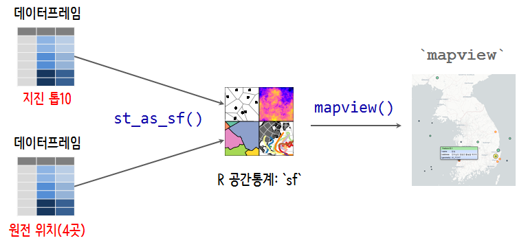

 
``` {r, include=FALSE}
knitr::opts_chunk$set(echo = TRUE, message=FALSE, warning=FALSE,
                      comment="", digits = 3, tidy = FALSE, prompt = FALSE, fig.align = 'center')

knitr::opts_chunk$set(cache = FALSE)

library(tidyverse)
library(readxl)
library(sf)
library(rvest)
library(ggpubr)
library(extrafont)
loadfonts()
library(tmap)

```

# 위경도가 포함된 데이터프레임 {#dataframe-long-lat}

데이터프레임에 위도와 경도가 포함된 경우 이를 좌표계정보를 더해 지도를 제작할 수 있다.

```{r convert-to-shapefile}

```


# 들어가며 {#earthquake-nuclear-prologue}

지진과 원전의 관계를 쉽게 이해하는 것도 중요하다. 
특히 동일본 후쿠시마 지진으로 인한 쓰나미로 원전이 침수되어 크나큰 문제가 되고 아직도 해결이 되지 않고 크나큰 후유증을 남기고 있다.

원전위치와 그동안 한반도에서 있었던 규모가 큰 지진의 관계를 통해 지진으로부터 원전위치가 갖는 의미를 시각적으로 확인하는 것이 큰 의미가 있을 것으로 판단된다.
이를 위해서 먼저 지진과 원전에 대한 데이터 수집이 필요하다.

데이터를 잘 보여줄 수 있도록 유연한 작업흐름을 갖추는 것도 중요하다. 
이를 위해서 R 기반 `tidyverse` 생태계에 편입된 자료구조와 시각화 도구를 적극 활용한다.



# 지진과 원전 데이터 [^rvest-encoding] {#earthquake-nuclear-setup}

[^rvest-encoding]: [rvest, html_table function error #117](https://github.com/hadley/rvest/issues/117)

우선 `rvest`를 통해 웹사이트에서 [국내지진 규모별 순위 상위 10개](http://www.weather.go.kr/weather/earthquake_volcano/scalelist.jsp) 데이터를 긁어오고,
원전 위치는 [한국원자력산업협회, 원전현황](http://www.kaif.or.kr/?c=nws&s=5)을 참고하여 
[대한민국 원자력 발전소 현황 (2016)](https://statkclee.github.io/data-product/shiny-nucelar-powerplant.html)을 참조한다.


``` {r earthquake-nuclear-data-import, warning=FALSE, message=FALSE, quietly=TRUE}
# 0. 환경설정 -----
library(sf)
library(tidyverse)
library(rvest)
library(httr)
library(sf)
library(leaflet)
library(mapview)

# 1. 데이터 가져오기 -----
## 1.1. 국내지진 규모별 순위 상위 10개
Sys.setlocale("LC_ALL", "C")

eq_url <- "http://www.weather.go.kr/weather/earthquake_volcano/scalelist.jsp"

eq_dat <- read_html(eq_url, encoding = "EUC-KR") %>% 
  html_nodes(xpath = '//*[@id="content_weather"]/table') %>% 
  html_table(fill = TRUE) %>% 
  .[[1]]

Sys.setlocale("LC_ALL", "Korean")

## 1.2. 원전 데이터 
np_df <- tribble(~name, ~address, ~lat, ~lon,
                "고리", "부산광역시 기장군 장안읍 고리", 35.459936176050455, 129.31042595766428,
                "월성", "경상북도 경주시 양남면 나아리", 35.61415131635102, 129.47316094301584,
                "한빛", "전라남도 영광군 홍농읍 계마리", 35.51221255154207, 126.578604835085,
                "한울", "경상북도 울진군 북면 부구리", 37.18011679577809, 129.16451181750688)

# 2. 데이터 정제하기 -----
names(eq_dat) <- c("No.", "규모", "발생연월일", "진원시", "lat", 
                         "lon", "진앙")

eq_df <- eq_dat %>% 
  filter(row_number() != 1) %>% 
  mutate(규모 = as.numeric(규모),
           lat = as.numeric(lat),
           lon = as.numeric(lon))
```


# 지진과 원전 데이터 전처리 [^geocompuation-with-r] {#earthquake-nuclear-preprocessing}

[^geocompuation-with-r]: [Robin Lovelace, Jakub Nowosad, Jannes Muenchow, Geocomputation with R, 2018-01-16](https://geocompr.robinlovelace.net/)

`sf` 팩키지 `st_as_sf()` 함수 하나로 데이터프레임을 지도객체로 간단히 변환시켜 공간정보 시각화가 가능하다.
즉, 데이터프레임을 넣고 위도 경도를 `coords` 인자로 넣어주고 `crs` 좌표계를 지정하면 된다.

``` {r earthquake-nuclear-data-preprocessing}
# 3. 데이터프레임을 지도객체로 변환 ------
eq_sf <- st_as_sf(eq_df, 
                  coords = c("lon", "lat"),
                  crs = 4326)

np_sf <- st_as_sf(np_df, 
                  coords = c("lon", "lat"),
                  crs = 4326)
```

# 지진과 원전 공간정보 시각화 {#earthquake-nuclear-viz}

마지막으로 `eq_sf` 지진 데이터를 갖는 지도객체와 `np_sf` 원전 위치 데이터를 갖는 지도객체를 `+` 연산자로 하나의 지도에 표현한다.

``` {r earthquake-nuclear-viz, cache=FALSE}
# 3. 데이터 시각화 -----
## 지진과 원전위치 함께 표시

mapview(eq_sf, 
        zcol = "규모", 
        cex = "규모",
        at = seq(4, 6, 0.5),
        hide =TRUE) +
mapview(np_sf,
        zcol = "name", 
        color = "red",
        col.regions = "yellow",
        hide =TRUE) 
```

