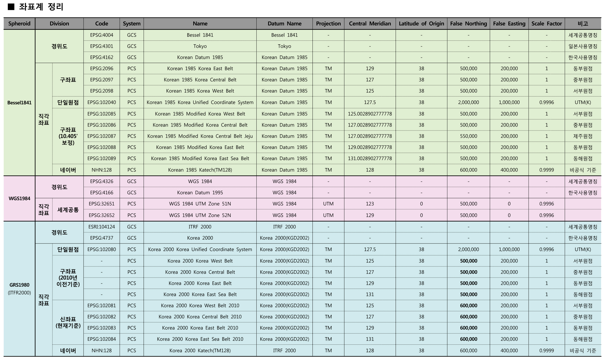

 
``` {r, include=FALSE}
knitr::opts_chunk$set(echo = TRUE, message=FALSE, warning=FALSE,
                      comment="", digits = 3, tidy = FALSE, prompt = FALSE, fig.align = 'center')
```


# 지리정보 파일 [^data-carpentry-shapefile] [^vector-raster] {#geoinfo-filename}

[^data-carpentry-shapefile]: [Data Carpentry, "Introduction to Geospatial Raster and Vector Data with R"](https://datacarpentry.org/r-raster-vector-geospatial/)

[^vector-raster]: [Justina Hensley, "Spatial data models (types)"](https://slideplayer.com/slide/6152526/)

전통적으로 지리정보는 `.shp` 확장자명을 갖는 ESRI Shapefile에 저장을 했다.
`*.shp`, `*.dbf`, `*.shx` 파일이 나눠서 저장되어 있다. 이로 인해서 ESRI Shapefile 지도정보 파일은
디렉토리에 담겨지게 된다.

- `*.shp`: `geometry` 정보(점, 선, 다각형)
- `*.dbf`: 각 `geometry`에 대한 속성정보 저장
- `*.shx`: `geometry`와 속성(attributes) 정보 연결
- `*.prj`:  좌표계 정보 저장

R 에서 ESRI Shapefile 파일을 저장하면 S4 `SpatailPolygonsDataFrame`으로 저장된다. 
따라서, 점/선/다각형이 담긴 `geometry`와 데이터프레임이 연결되어 저장되어 있다.

실제 세상을 지도로 표현함에 있어 두가지 방식을 사용한다.
하나는 벡터(vector)로 표현하는 것이고 `OGR`을 사용하고, 또 다른 하나는 격자(Grid), 래스터(raster)로 
표현하는 것으로 `GDAL`을 아래에 각각 깔고 R로 불러와서 사용하게 된다.


# 좌표계(CRS) [^korean-crs] [^crs-concept] {#geoinfo-CRS}

[^korean-crs]: [OSGeo(Open Source GeoSpatial) 한국어 지부 - OSGeo Korean Chapter, "한국 주요 좌표계 EPSG코드 및 proj4 인자 정리""](https://www.osgeo.kr/17)

[^crs-concept]: [Wolfgang SCHEUCHER (Solitec), "Coordinate Reference System"](https://ext.eurocontrol.int/aixm_confluence/display/ACG/Coordinate+Reference+System)

좌표계(CRS, Coordinate Reference System)는 둥근 지구를 2차원 평면에 투영(projection)하는 다양한 방법을 지칭한다.
좌표계를 제작할 때 각기 다른 목적에 맞춰 제작되었기 때문에 지리정보를 활용함에 있어 적절한 좌표계를 채택하여활용하는 것이 중요하다.
많이 사용되는 좌표계는 다음이 있다.
WGS84(WGS 1984, EPSG:4326, WGS84)는 세계 지구 좌표 시스템(World Geodetic System, WGS) 1984년에 제정된 범 지구적 측위 시스템으로 지도학, 측지학, 항법에 많이 사용된다.

좌표계를 특정하는 방식은 [**EPSG** 숫자코드](https://spatialreference.org/ref/epsg/)를 사용하는 방법과 [**PROJ4** 정형문자열](https://proj.org/apps/proj.html) 방식이 있다. EPSG 코드가 항상 특정 좌표시스템과 대응되지는 않지만, 공간 정보를 담고 있는 객체(spatial object)가 특정 좌표계를 갖고 있다면 PROJ4 투영 문자열을 항상 갖게된다.

- 전지구 좌표계: 전세계를 한번에 나타내야 할 때 많이 쓰이는 좌표계
    - **EPSG:3857** &rarr;  Google Mercator
        - 서비스: 구글 지도(Google Maps), 빙 지도(Bing Maps), 야후지도, OSM(Open Street Maps)
        - 단위: 미터
        - `+proj=merc +a=6378137 +b=6378137 +lat_ts=0.0 +lon_0=0.0 +x_0=0.0 +y_0=0 +k=1.0 +units=m +nadgrids=@null +no_defs`
    - **EPSG:4326** &rarr; WGS84 경위도: GPS가 사용하는 좌표계
        - 서비스: 구글 지구(Google Earth)
        - 단위: 소수점 (decimal degrees)
        - `+proj=longlat +ellps=WGS84 +datum=WGS84 +no_defs`
- 타원체 바꾼 지리원 표준: 과거 지리원 좌표계에서 타원체와 lon_0 문제를 수정한 좌표계로 2000년대 초반에 잠시 많이 사용
    - **EPSG:5181**  &rarr; 중부원점(GRS80)
        - 서비스: 다음카카오 지도 API [^kakao-api-crs]
        - CRS 스펙: `+proj=tmerc +lat_0=38 +lon_0=127 +k=1 +x_0=200000 +y_0=500000 +ellps=GRS80 +units=m +no_defs`
- KATEC 계열: 한반도 전체를 하나의 좌표계로 나타낼 때 많이 사용하는 좌표계
    - **EPSG:5179** &rarr; UTM-K (GRS80) [^naver-crs]
        - 서비스: 네이버지도
        - CRS 스펙: `+proj=tmerc +lat_0=38 +lon_0=127.5 +k=0.9996 +x_0=1000000 +y_0=2000000 +ellps=GRS80 +units=m +no_defs`
    - **EPSG:5178** &rarr; UTM-K (Bessel)
        - 서비스: 새주소지도
        - CRS 스펙: `+proj=tmerc +lat_0=38 +lon_0=127.5 +k=0.9996 +x_0=1000000 +y_0=2000000 +ellps=bessel +units=m +no_defs +towgs84=-145.907,505.034,685.756,-1.162,2.347,1.592,6.342`
- 현재 국토지리정보원 표준: 2002년 이후에 국토지리정보원 지형도에서 사용중인 좌표계
    - **EPSG:5185** &rarr; 서부원점(GRS80)-falseY:60000
        - CRS 스펙: `+proj=tmerc +lat_0=38 +lon_0=125 +k=1 +x_0=200000 +y_0=600000 +ellps=GRS80 +units=m +no_defs`
    - **EPSG:5186** &rarr; 중부원점(GRS80)-falseY:60000
        - CRS 스펙: `+proj=tmerc +lat_0=38 +lon_0=127 +k=1 +x_0=200000 +y_0=600000 +ellps=GRS80 +units=m +no_defs`
    - **EPSG:5187** &rarr; 동부원점(GRS80)-falseY:60000
        - CRS 스펙:` +proj=tmerc +lat_0=38 +lon_0=129 +k=1 +x_0=200000 +y_0=600000 +ellps=GRS80 +units=m +no_defs`
    - **EPSG:5188** &rarr; 동해(울릉)원점(GRS80)-falseY:60000
        - CRS 스펙: `+proj=tmerc +lat_0=38 +lon_0=131 +k=1 +x_0=200000 +y_0=600000 +ellps=GRS80 +units=m +no_defs`

[^kakao-api-crs]: [Kakao DevTalk, "다음지도 좌표계 관련"](https://devtalk.kakao.com/t/topic/35844)

[^naver-crs]: [VISUALIZING STORY - STORY ABOUT TRUTH AND LIFE, "한국 주요 좌표계 EPSG코드 및 PROJ4 인자정리"](https://visualizingstory.wordpress.com/2013/04/24/%ED%95%9C%EA%B5%AD-%EC%A3%BC%EC%9A%94-%EC%A2%8C%ED%91%9C%EA%B3%84-epsg%EC%BD%94%EB%93%9C-%EB%B0%8F-proj4-%EC%9D%B8%EC%9E%90-%EC%A0%95%EB%A6%AC/#respond)


## 좌표계 종류와 파일 [^crs-types-coordinate] {#coordinate-types-files}

[^crs-types-coordinate]: [조덕연, "8. 기타 자료 우리나라에서 사용하는 좌표계의 종류 및 좌표계 파일", biz-gis.com ](http://www.biz-gis.com/index.php?mid=pds&document_srl=67326)

우리나라에서 사용하는 좌표계의 종류도 너무 많고 설정 수치도 다양한데 조덕연님이 2012년 대한민국 좌표계에 대해서 다음과 같이 잘 정리해 주셨다.




# 공간 데이터 과학 R 생태계 [^user2020-rspatial] [^spatial-ecosystem] {#geoinfo-packages}

[^user2020-rspatial]: [Sébastien Rochette, Dorris Scott, Jakub Nowosad (2020), "First steps in spatial handling and visualization"](https://github.com/statnmap/user2020_rspatial_tutorial)

[^spatial-ecosystem]: [Kim A. Etienne C. Timothée G., "Spatial Data and Cartography with R", SatRday Paris February 2019](https://comeetie.github.io/satRday/lecture/lecture.html)

## 현재 인기있는 R 공간 팩키지 {#geoinfo-packages-modern}

R에서 공간 지리 통계 및 공간 지리 데이터를 다루는 팩키는 `rgdal`, `sp`, `rgeos`가 개발되어 사용되고 있었다.

- `sp`: R에서 공간 데이터(spatial data)를 표현하는 클래스와 메쏘드 자료구조.
- `rgdal`: R과  [GDAL (Geospatial Data Abstraction Library)](https://gdal.org/) and [PROJ4](https://github.com/OSGeo/PROJ) 라이브러리를 연결시키는 인터페이스 팩키지 - 래스터 / 벡터 지리공간 데이터 형식과 좌표 변환 기능 담당
- `rgeos`: R과 [`GEOS - Geometry Engine`](https://trac.osgeo.org/geos/) 라이브러리를 연결시키는 인터페이스 팩키지 - 면적, 둘레 길이, 거리, 다양한 지도 연산(dissolve, buffer, overlap, union, contains, ...)

하지만, 2016년 10월 20일 [`sf`](https://r-spatial.github.io/sf/index.html)가 발표되면서 `sp`, `rgeos`, `rgdal` 3개 핵심 팩키지가 하나로 통합되었다. `sp` 팩키지 저자 Edzer Pebesm가 `sp`를 주도하고 있으며 `tidyverse`와 호환되고 파이프 구문 등 철학을 공유하고 있다.


- 공간 데이터 
    - `sp`: [sp: Classes and Methods for Spatial Data](https://cran.r-project.org/web/packages/sp/index.html)
    - `sf`: [sf](https://cran.r-project.org/web/packages/sf/index.html)
        - 'GDAL': 데이터를 불러오고 저장.
        - 'GEOS': geometry 연산작업
        - 'PROJ': 좌표계 변환(projection conversions and datum transformations)
    - `stars`: [Spatiotemporal tidy arrays for R](https://github.com/r-spatial/stars)        
- 정적 시각화
    - `ggmap`: [ggmap: Spatial Visualization with ggplot2](https://cran.r-project.org/web/packages/ggmap/index.html)
    - `cartography`: [Create and integrate maps in your R workflow!](https://github.com/riatelab/cartography) - Base 그래픽에 기반을 두고 있으며 기본적인 지도 뿐만 아니라 고급 지도 표현도 가능하다.
- 인터랙티브 시각화
    - `leaflet`: [Open-source JavaScript libraries for interactive maps](https://rstudio.github.io/leaflet/)
    - `tmap`: [tmap: Thematic Maps](https://github.com/mtennekes/tmap)
    - `mapview`: [mapview: Interactive Viewing of Spatial Data in R](https://github.com/r-spatial/mapview)
    - `mapdeck`: [mapdeck: Interactive Maps Using 'Mapbox GL JS' and 'Deck.gl'](https://github.com/SymbolixAU/mapdeck)

---

<div class = "row">
  <div class = "col-md-6">
**`sp`: `sf` 이전 시절**

`sp`, `rgdal`, `rgeos`를 결합하여 사용하던 옛시절이 있었다.

- `sp`: 벡터 혹은 래스터 공간정보 데이터를 다루기 위한 기본 자료구조.
- `rgdal`: `GDAL`/`OGR`을 바탕으로 공간데이터를 불러오고 저장하는 역할을 담당.
- `rgeos`: 파이썬 `shapely`처럼 `GEOS`를 바탕으로 다양한 `geometry` 연산작업을 수행(`union`, `intersections`, `buffer` 등).

  </div>
  <div class = "col-md-6">
  
**`sf` 통일 시대**

- 실세계에서 객체가 어떻게 표현되어야 하는지를 모사하는 `ISO 19125-1:2004` 표준 **`Simple Feature`**를 충실히 따름.
- `sf`의 기본은 데이터프레임
- `sp`, `rgdal`, `rgeos` 팩키지 모든 기능을 `sf` 하나에 담아냄.
- `sp`, `rgdal` 보다 설치하기 쉽고 훨씬 더 빠르고 확장성이 뛰어남.

  </div>
</div>

## 공간지도 R 팩키지 스티커 {#rspatial-stickers}

[`stickr`]()

```{r install-sticker}
library(stickr)
library(magick)

sf_sticker <- stickr_get("sf", view=FALSE)

image_read(sf_sticker) %>% 
  image_resize("33%")
```


# `rspatial` 생태계 [^recent-change-rspatial] {#all-about-rspatial-ecosystem}

[^recent-change-rspatial]: [J. Nowosad, R. Lovelace (2020), "Recent changes in R spatial and how to be ready for them", Why R](https://nowosad.github.io/whyr_webinar004/)

과거 많이 생산된 ESRI `.shp` 지도데이터와 표준으로 자리잡고 있는 `.gpkg` 파일을 `read_sf()` 함수로 불러 읽어들인다. 그리고 나서 `tmap` 팩키지의 다양한 지도 생성 동사를 동원하여 빠르게 시각화한다.


