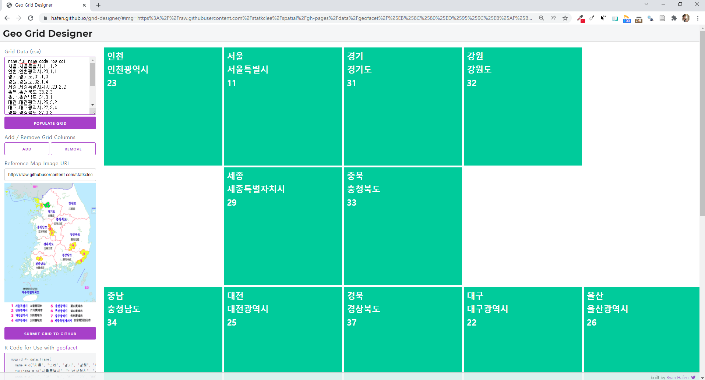

 
``` {r setup, include=FALSE}
library(tidyverse)
knitr::opts_chunk$set(echo = TRUE, message=FALSE, warning=FALSE,
                      comment="", digits = 3, tidy = FALSE, prompt = FALSE, fig.align = 'center')

sido_code_tbl <- tribble(~"시도", ~"시도명", ~"코드", 
                         "서울", "서울특별시", "11", 
                         "부산", "부산광역시", "21", 
                         "대구", "대구광역시", "22", 
                         "인천", "인천광역시", "23", 
                         "광주", "광주광역시", "24", 
                         "대전", "대전광역시", "25", 
                         "울산", "울산광역시", "26", 
                         "세종", "세종특별자치시", "29", 
                         "경기", "경기도", "31", 
                         "강원", "강원도", "32", 
                         "충북", "충청북도", "33", 
                         "충남", "충청남도", "34", 
                         "전북", "전라북도", "35", 
                         "전남", "전라남도", "36", 
                         "경북", "경상북도", "37", 
                         "경남", "경상남도", "38", 
                         "제주", "제주특별자치도", "39")
```


# `Geo Grid Designer` {#geo-grid-designer}

[Geo Grid Designer](https://hafen.github.io/grid-designer/)를 사용해서 지도격자(geo grid)를 작성할 수 이고, 이미 제작된 지도격자를 `grid_preview()` 함수를 사용해서 확인도 가능하다.  

```{r grid-seoul}
library(geofacet)
library(tidyverse)

grid_preview(kr_seoul_district_grid1)
```

서울은 있지만 대한민국은 업어 Geo Grid Designer 를 사용해서 제작한다. 하단에 `Submit Grid to Github` 버튼을 누르면 [new grid, Republic of Korea - Province level (SIDO) #356](https://github.com/hafen/geofacet/issues/356)와 같이 Issues 탭에 올릴 수 있다.



# 활용사례 {#geo-grid-designer-usecase}

`geofacet` 패키지에 올라간 것은 아니기에 다음과 같이 활용을 해보자.

```{r geofacet-usecase}
library(geofacet)
library(tidyverse)

sido_grid_tbl <- tribble(~"name", ~"fullname", ~"code", ~"row", ~"col",
                         "서울", "서울특별시",11,1,2,
                         "인천", "인천광역시",23,1,1,
                         "경기", "경기도",31,1,3,
                         "강원", "강원도",32,1,4,
                         "세종", "세종특별자치시",29,2,2,
                         "충북", "충청북도",33,2,3,
                         "충남", "충청남도",34,3,1,
                         "대전", "대전광역시",25,3,2,
                         "대구", "대구광역시",22,3,4,
                         "경북", "경상북도",37,3,3,
                         "울산", "울산광역시",26,3,5,
                         "부산", "부산광역시",21,4,4,
                         "경남", "경상남도",38,4,3,
                         "전북", "전라북도",35,4,1,
                         "광주", "광주광역시",24,4,2,
                         "전남", "전라남도",36,5,2,
                         "제주", "제주특별자치도",39,5,3) %>% 
  select(name, code, row, col)

voters_tbl <- krvotes::president_2012 %>% 
  select(시도명, 박근혜:문재인) %>% 
  pivot_longer(cols = 박근혜:문재인) %>% 
  group_by(시도명, name) %>% 
  summarise(득표 = sum(value)) %>% 
  left_join(sido_code_tbl) %>% 
  rename(code = 코드)

voters_tbl %>% 
  mutate(`득표(만표)` = 득표/10^4) %>% 
  ggplot(aes(x=name, y = `득표(만표)`, fill =name)) +
    geom_col() +
    coord_flip() +
    facet_geo(~ code, grid = sido_grid_tbl, label = "name", scales = "free") +
    scale_y_continuous(labels = scales::comma) +
    scale_fill_manual(values = c("red", "blue")) +
    theme(legend.position = "none")
```

