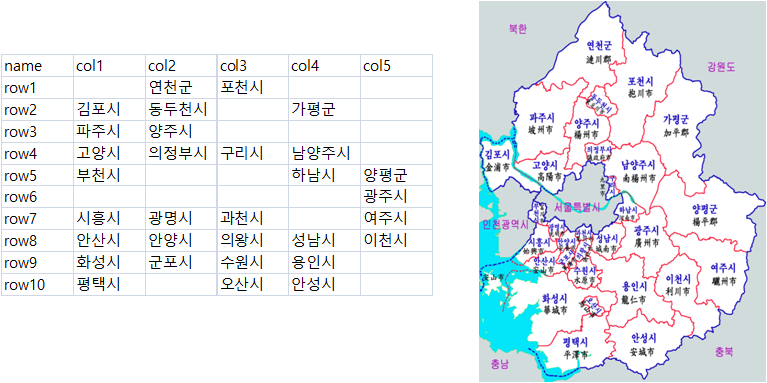

 
```{r setup, include=FALSE}
knitr::opts_chunk$set(echo = TRUE, warning=FALSE, message=FALSE, quietly=TRUE)


```

# 1. 경기도 대통령선거 19대 공간정보 {#gg-geofacet}

[위키백과 - 경기도의 행정 구역](https://ko.wikipedia.org/wiki/%EA%B2%BD%EA%B8%B0%EB%8F%84%EC%9D%98_%ED%96%89%EC%A0%95_%EA%B5%AC%EC%97%AD)의 지도를 참조하여 
카토그램을 표현해보자. [geofacet](https://github.com/hafen/geofacet/)을 비롯한 [tilegramsR](https://github.com/bhaskarvk/tilegramsR), 
[변량비례도(cartogram)](https://cran.r-project.org/web/packages/cartogram/index.html)이 존재하지만 복잡한 지하철 노선도를 단순화한 
방식이 더 직관적이고 선명한 정보를 제공하는 것도 사실이다.

## 1.1. 경기도 격자 지도 {#gg-geofacet-draw}

[geofacet](https://github.com/hafen/geofacet/) 관련정보 시각화를 위해서 가장 먼저 지도를 생성해야 한다.
다양한 방법이 있겠지만 우선 해당 지도(경기도)를 대상으로 행과 열로 위치를 표현한다.



다음으로 횡으로 폭이 넓은 와이드(wide) 형태 데이터를 `col`, `row`가 있는 형태로 데이터를 변환해야 하는데 이를 위해서 
`gather()` 함수를 사용해서 긴형태로 데이터를 변환시킨다.

``` {r gg-facet-grid}
# 0. 환경설정 -----
library(geofacet) # install.packages("geofacet")
library(tidyverse)
library(readxl)
library(extrafont)
loadfonts()

# 1. 데이터 ----
## 1.1. 지도 데이터 -----
map_df <- read_excel("data/선거지도.xlsx", sheet="경기도")

gg_grid_df <- map_df %>% 
  gather(sigun, sigunname, -name, convert=TRUE) %>% 
  mutate(row = str_extract_all(name, "[0-9]+") %>% unlist,
         col = str_extract_all(sigun, "[0-9]+") %>% unlist)  %>% 
  filter(!is.na(sigunname)) %>% 
  mutate(name = sigunname) %>% 
  select(row, col, code=sigunname, name)
```

## 1.2. 대통령선거 데이터 {#gg-geofacet-vote-data}

대통령선거 데이터를 중앙선거관리위원회 자료실에서 다운로드 받아 경기도만 뽑아내고, 이를 `geofacet` 격자에 맞춰 시군으로 정리한다.
수원, 성남 등 6개 시는 내부에 구가 다수 있어 이를 하나의 시로 묶어내는 작업을 별도로 수행한다.

``` {r geofacet-presid-data}
## 1.2. 선거 데이터 ----
presid_19_dat <- read_excel("data/@@20170510-19대선-투표구별개표자료(공개용).xlsx", skip=3)

names(presid_19_dat) <- c("시도명", "구시군명", "읍면동명", "투표구명", "선거인수", "투표수", "문재인", 
                          "홍준표", "안철수", "유승민", "심상정", "새누리당\r\n조원진", "경제애국당\r\n오영국", 
                          "국민대통합당\r\n장성민", "늘푸른한국당\r\n이재오", "민중연합당\r\n김선동", 
                          "한국국민당\r\n이경희", "홍익당\r\n윤홍식", "무소속\r\n김민찬", "계", "무효투표수", "기권수")

presid_19_df <- presid_19_dat %>% 
  select_("시도명", "구시군명", "읍면동명", "투표구명", "선거인수", "투표수", "문재인", "홍준표", "안철수", "유승민", "심상정") %>% 
  mutate(구시군명 = ifelse(시도명 == "전국", "합계", 구시군명)) %>% 
  mutate(읍면동명 = ifelse(구시군명 == "합계", "합계", 읍면동명)) %>% 
  mutate(투표구명 = ifelse(is.na(투표구명), 읍면동명, 투표구명)) %>% 
  filter(str_detect(시도명, "경기"), !str_detect(읍면동명, "잘못")) 

gg_vote_df <- presid_19_df %>% 
  filter(구시군명 != "합계",
         읍면동명 == "합계") %>% 
  mutate(구시군명 = case_when(str_detect(구시군명, "수원") ~ "수원시",
                          str_detect(구시군명, "성남") ~ "성남시",
                          str_detect(구시군명, "안양") ~ "안양시",
                          str_detect(구시군명, "안산") ~ "안산시",
                          str_detect(구시군명, "고양") ~ "고양시",
                          str_detect(구시군명, "용인") ~ "용인시",
                          TRUE ~ 구시군명)) %>% 
  select(c(2,7:11)) %>% 
  group_by(구시군명) %>% 
  summarise(문재인 = sum(문재인),
               홍준표 = sum(홍준표),
               안철수 = sum(안철수),
               유승민 = sum(유승민),
               심상정 = sum(심상정))
```

# 2. 대통령선거 데이터 {#gg-geofacet-vote-data}

경기도 대통령 선거 데이터를 시각화하기 위해서 후보(`candidate`)를 기호순으로 요인형 변수로 지정하고 
`scale_fill_manual()`에 각 정당 대표 색상을 입힌다. 주목할 점은 `facet_geo()` 함수에 `grid = gg_grid_df` 지정한다.

``` {r geofacet-gg-viz, fig.width=12, fig.height=12}
# 3. 시각화 -----
gg_vote_df %>% 
  rename(name = 구시군명) %>% 
  gather(candidate, votes, -name) %>% 
  mutate(candidate = factor(candidate, levels=c("문재인", "홍준표","안철수","유승민", "심상정"))) %>% 
  ggplot(aes(fct_rev(candidate), votes, fill=candidate)) +
    geom_bar(stat="identity") +
    coord_flip() +
    theme_bw(base_family = "NanumGothic") +
    facet_geo(~ name, grid = gg_grid_df) +
    theme(strip.text.x = element_text(size = 8),
          axis.text=element_text(size=6),
          legend.position="none") +
    labs(x="", y="") +
    scale_y_continuous(labels = scales::comma) +
    scale_fill_manual(values= c("blue", "red", "green", "skyblue", "yellow"))
```

지리정보와 결합된 대통령선거 결과는 시각적으로 새로운 결과를 제공한다.

