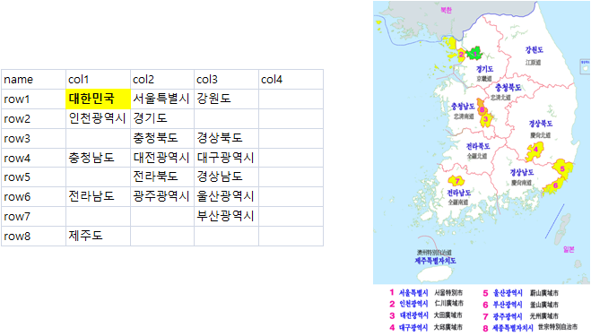

 
```{r setup, include=FALSE}
knitr::opts_chunk$set(echo = TRUE, warning=FALSE, message=FALSE, quietly=TRUE)


```

# 1. 시도별 실업률 추세 데이터 {#sido-unemp}

시도별 실업률 추세는 [행정구역(시도)/연령별 실업률](http://kosis.kr/statHtml/statHtml.do?orgId=101&tblId=DT_1DA7107S&vw_cd=MT_ZTITLE&list_id=B15&seqNo=&lang_mode=ko&language=kor&obj_var_id=&itm_id=&conn_path=MT_ZTITLE)를 
통해 다운로드할 수 있다. 시도별 실업률 데이터를 분기별로 상세시 받을 필요는 없이 연도별로 받아 실업률 시각화에 필요한 데이터를 준비한다.


# 2. 대한민국 격자지도 {#sido-grid}

`geofacet` 관련정보 시각화를 위해서 가장 먼저 지도를 생성해야 하는데 구글링을 통해 
적절한 대한민국 행정지도를 구해 다음과 같이 정리한다. 
격자지도 생성시 대한민국 전체 실업률이 좌측상단에 별도로 만들어 구성한다.



# 3. 시도별 실업률 추세 {#sido-unemp-trend}

## 3.1. 환경설정 {#sido-unemp-trend-setup}

시도별 실업률 추세 시각화 환경설정을 위한 관련 팩키지를 가져오고 `geofacet` 격자지도도 준비한다.
[KOSIS, 국가통계포털](http://kosis.kr/index/index.do)에서 행정구역 시도 연령별 실업률 데이터도 가져온다.

``` {r sido-unemp-trend}
# 0. 환경설정 -----
library(geofacet) # install.packages("geofacet")
library(tidyverse)
library(xts)
library(readxl)
library(extrafont)
loadfonts()

# 1. 데이터 ----
## 1.1. 지도 데이터 -----
kr_df <- read_excel("data/선거지도.xlsx", sheet="시도")

kr_grid_df <- kr_df %>% 
  gather(sido, sidoname, -name, convert=TRUE) %>% 
  mutate(row = str_extract_all(name, "[0-9]+") %>% unlist,
         col = str_extract_all(sido, "[0-9]+") %>% unlist)  %>% 
  filter(!is.na(sidoname)) %>% 
  mutate(name = sidoname) %>% 
  select(row, col, code=sidoname, name)

# 2. 실업률 데이터 ----
unemp_dat <- read_excel("data/행정구역_시도__연령별_실업률_20180317212807.xlsx", sheet="데이터")
```

## 3.2. 실업률 데이터 {#sido-unemp-trend-wrangling}

시도별 실업률 추세 시각화를 위해 실업률 데이터를 적절한 형태로 가공한다.
특히 전체실업률, 청년실업률, 장년실업률, 노인실업률로 나눠서 각시도별 실업률 추세를 살펴볼 수 있도록 데이터를 준비한다.

``` {r sido-unemp-trend-wrangling}
## 2.1. 전체 합계 실업률
unemp_df <- unemp_dat %>% 
  mutate(시도별 = na.locf(시도별)) %>% 
  filter(연령계층별 == "계") %>% 
  select(-2) %>% 
  gather(연도, 실업률, -시도별) %>% 
  filter(!str_detect(시도별, "세종")) %>% 
  rename(name = 시도별) %>% 
  mutate(실업률 = round(as.numeric(실업률),1)) %>% 
  filter(연도 >=2010)
  
## 2.2. 청년 실업률
young_unemp_df <- unemp_dat %>% 
  mutate(시도별 = na.locf(시도별)) %>% 
  filter(str_detect(연령계층별, "29세")) %>% 
  select(-2) %>% 
  gather(연도, 실업률, -시도별) %>% 
  filter(!str_detect(시도별, "세종")) %>% 
  rename(name = 시도별) %>% 
  mutate(실업률 = round(as.numeric(실업률),1)) %>% 
  filter(연도 >=2010)

## 2.3. 장년 실업률
middle_unemp_df <- unemp_dat %>% 
  mutate(시도별 = na.locf(시도별)) %>% 
  filter(str_detect(연령계층별, "59세")) %>% 
  select(-2) %>% 
  gather(연도, 실업률, -시도별) %>% 
  filter(!str_detect(시도별, "세종")) %>% 
  rename(name = 시도별) %>% 
  mutate(실업률 = round(as.numeric(실업률),1)) %>% 
  filter(연도 >=2010)

## 2.4. 노인 실업률
old_unemp_df <- unemp_dat %>% 
  mutate(시도별 = na.locf(시도별)) %>% 
  filter(str_detect(연령계층별, "60세이상")) %>% 
  select(-2) %>% 
  gather(연도, 실업률, -시도별) %>% 
  filter(!str_detect(시도별, "세종")) %>% 
  rename(name = 시도별) %>% 
  mutate(실업률 = round(as.numeric(실업률),1)) %>% 
  filter(연도 >=2010)
```

# 4. 시도별 실업률 추세 시각화 {#sido-unemp-trend-viz}

## 4.1. 시도별 종합 실업률 추세 {#sido-unemp-trend-viz-total}

가장 먼저 청년, 중장년, 노년을 아우르는 전체 실업률을 각 시도별로 살펴본다.
대한민국 실업률이 대략 3.5%로 안정되어 있지만 2013년 이후 최근 증가하는 추세를 보이고 있다.
전라남도, 부산, 전라북도는 2015년 이후 실업률이 증가추세에 있다.

``` {r sido-unemp-trend-viz-total, fig.width=12, fig.height=10}
# 3. 시각화 -----
## 3.1. 전체 합계 실업률
ggplot(unemp_df, aes(x=연도, y=실업률, group=name, color=name)) +
  geom_line() + 
  geom_point() +
  theme_bw(base_family = "NanumGothic") +
  facet_geo(~ name, grid = kr_grid_df, scales="free") +
  theme(strip.text.x = element_text(size = 8),
        axis.text=element_text(size=8),
        legend.position = "none") +
  labs(x="", y="") +
  scale_y_continuous(labels = scales::comma, breaks = seq(1,5, 0.5))
```

## 4.2. 시도별 청년 실업률 추세 {#sido-unemp-trend-viz-youth}

청년실업률은 우선 실업률의 단위가 10%대에서 움직이고 있으며 경기도에 특히 2012년 이후 지속적으로 증가하는 것이 눈에 띈다.

``` {r sido-unemp-trend-viz-youth, fig.width=12, fig.height=10}
## 3.2. 청년 실업률
ggplot(young_unemp_df, aes(x=연도, y=실업률, group=name, color=name)) +
  geom_line() + 
  geom_point() +
  theme_bw(base_family = "NanumGothic") +
  facet_geo(~ name, grid = kr_grid_df, scales="free") +
  theme(strip.text.x = element_text(size = 8),
        axis.text=element_text(size=8),
        legend.position = "none") +
  labs(x="", y="") +
  scale_y_continuous(labels = scales::comma, breaks = seq(5,20,2))
```

## 4.3. 시도별 중장년 실업률 추세 {#sido-unemp-trend-viz-middle}

대한민국을 지탱하는 중장년층 실업률은 2~3%대로 다른 연령층보다 낮지만 최근경제 상황을 반영하여 
전라남도와 전라북도를 비롯해서 일부 지자체에서 상승세가 높게 나타나고 있다.

``` {r sido-unemp-trend-viz-middle, fig.width=12, fig.height=10}
## 3.3. 장년 실업률
ggplot(middle_unemp_df, aes(x=연도, y=실업률, group=name, color=name)) +
  geom_line() + 
  geom_point() +
  theme_bw(base_family = "NanumGothic") +
  facet_geo(~ name, grid = kr_grid_df, scales="free") +
  theme(strip.text.x = element_text(size = 8),
        axis.text=element_text(size=8),
        legend.position = "none") +
  labs(x="", y="") +
  scale_y_continuous(labels = scales::comma, breaks = seq(1,10,0.5))
```

## 4.4. 시도별 노인 실업률 추세 {#sido-unemp-trend-viz-old}

청년 실업율보다는 낮지만 시도별로 노인실업률에 차이가 나고 특히, 경기도에서는 2013년 이후 가파르게 늘어나는 것이 눈에 포착된다.

``` {r sido-unemp-trend-viz-old, fig.width=12, fig.height=10}
## 3.4. 노인 실업률
ggplot(old_unemp_df, aes(x=연도, y=실업률, group=name, color=name)) +
  geom_line() + 
  geom_point() +
  theme_bw(base_family = "NanumGothic") +
  facet_geo(~ name, grid = kr_grid_df, scales="free") +
  theme(strip.text.x = element_text(size = 8),
        axis.text=element_text(size=8),
        legend.position = "none") +
  labs(x="", y="") +
  scale_y_continuous(labels = scales::comma, breaks = seq(1,10,0.5))
```


